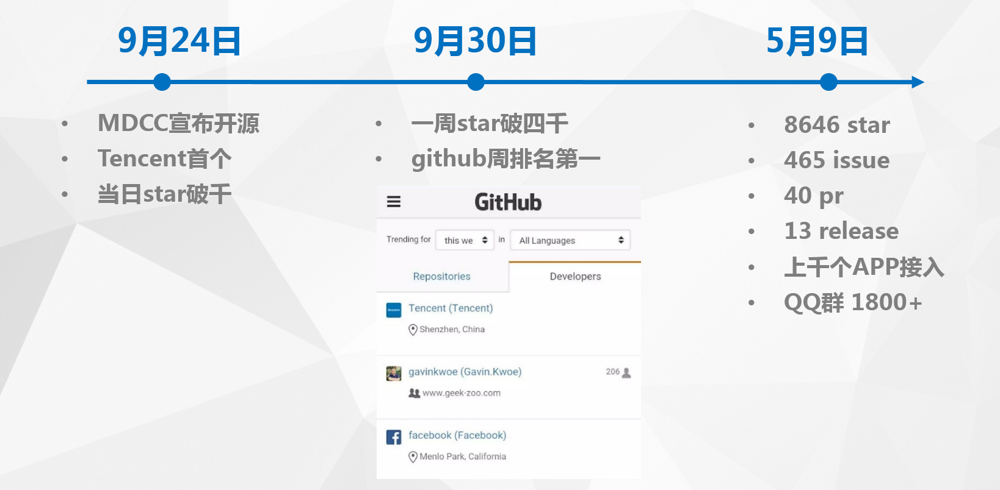
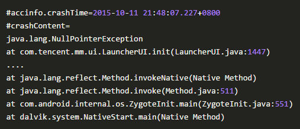
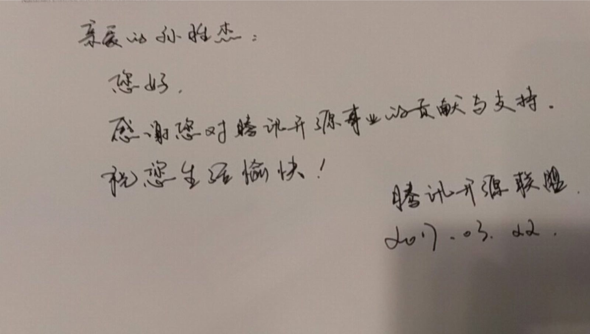
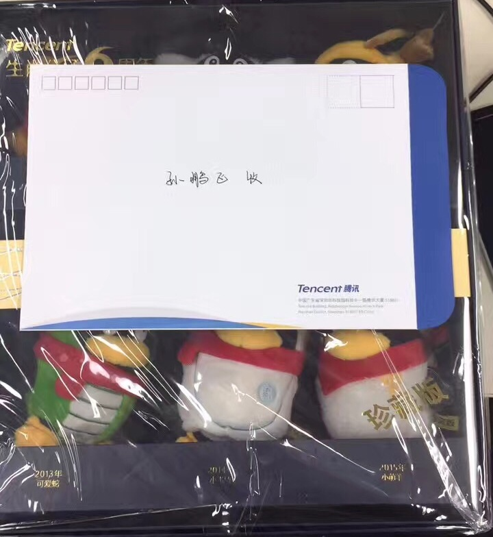

# Tinker：技术的初心与坚持 #
2016年3月10日，Tinker项目正式启动，并在同年9月23日举行的MDCC会议上开源。一年过去了，两个人，50%的工作时间。总的来说，填了一些坑，获得少许成绩，也遭受不少批评。究竟Tinker是否将已经很糟糕的Android的生态变得更差，会不会对用户的安全造成更大的挑战？

回想Tinker的初心，我们希望开发者可以用很小代价进行快速升级，它是国内追求快速迭代诉求。立项至今，Tinker踩了很多坑也填了很多坑。今天，我希望跟大家分享这一年来我们遇到的一些问题，以及解决它们的思路与过程。

## Tinker的现状 ##
首先在回顾过去之前，我想先简单的介绍一下Tinker的现状。

### 开源的现状  ###
Tinker的开源地址为：[https://github.com/Tencent/tinker](https://github.com/Tencent/tinker)。它作为Github/Tencent的第一个开源项目，也让Tencent第一次在Github周排名第一。微信也在持续使用Tinker，并且我们承诺与外部开发者使用同样的开源版本。不仅如此，在应用宝Top 1000的应用中，有60多个应用已经使用了Tinker，使用第三方平台接入Tinker并持续使用的应用也超过1000个。



### 生态的现状  ###
使用的开发者数是一方面，更令人振奋的是，Tinker初步建立了它自己的小生态。

**一. 热修复服务平台**

个人感觉热补丁不是请客吃饭，如果不了解它，直接使用它可能会造成更大的问题，所以在一些接入上面，的确人为的增加了难度。
>热修复不是请客吃饭  

对于某些的产品来说并不一定成立，它们希望无论客户端、后台都有一整套的服务，它只要：
>一行代码，快速接入

当前[TinkerPatch](http://www.tinkerpatch.com/)与[Bugly](https://bugly.qq.com/v2/)都基于Tinker提供了热修复的一站式服务，降低了许多开发者的工作。

**二. 厂商**

受益于微信的产品影响力，我们与OPPO、Vivo、Huawei、小米、一加、联想等厂商都建立了紧密的联系。他们不仅帮助我们解决了许多兼容性问题，每次Tinker升级，厂商也会帮忙做相关兼容性的测试。更重要的是Tinker的出现与推广使得厂商在系统定制改造时也会考虑到是否会影响热修复。

同时我们一直极力反对厂商对微信做定制的优化，我们希望在Tinker框架内能够解决，所有的用户所有的产品表现是一致的。在这一年来，的确十分感谢厂商的帮助与支持。

**三. 加固**

对于许多开发者，它们因为各种各样的原因必须要使用加固。首先在`1.7.0`版本我们通过回退QZone的方案支持加固，但是发现市面上各种的加固实现差异非常大，且对我们是黑箱。最终在`1.7.6`版本取消了对加固的支持。最近我们联合乐加固、360、爱加密等加固厂商，一起讨论协商了支持热修复的加固方案。最终我们商定如下规则：

1. 不能提前导入类；
2. 在Art平台若要编译oat文件，需要将内联取消。

我们并不想让它们仅仅支持Tinker，我们希望整个生态是健康的，其他的热修复方案也应该被支持。随着加固厂商陆续发布了新版，Tinker在1.7.9版本也可以很好的支持上述加固厂商。

此外我们也看到有一些基于Tinker衍生的开源项目，例如[tinker-dex-dump](https://github.com/LaurenceYang/tinker-dex-dump) 、[tinker-manager](https://github.com/baidao/tinker-manager)、[TinkerPatch](https://github.com/TinkerPatch)等。

## 跪着走完的路 ##
一个开源项目不仅仅是一堆源码，更像一个产品。这里需要很多技术之外的努力，与第三方平台、厂商沟通，争取加固厂商的支持等等。但是技术本身才是最大的影响因素，我们一直坚持使用最大的努力去保证质量。下面简单回顾一下Tinker这一年遇到的一些比较有代表性的问题。大家可能不一定会遇到，希望解决问题的思路与过程会对你们有所启发。

### 一、Qzone方案在Dalvik与Art的问题分析 ###
Qzone方案在Dalvik与Art的问题是我们在热修复道路上第一个比较大的挑战，也是我们启动Tinker项目的主要原因。详细分析可以参考[微信Android热补丁实践演进之路](https://mp.weixin.qq.com/s?__biz=MzAwNDY1ODY2OQ==&mid=2649286306&idx=1&sn=d6b2865e033a99de60b2d4314c6e0a25#rd)。

以Art地址偏移的例子来说，当时我们某次补丁发现在5.0的机器线上发现以下的一个crash：



对应的crash路径对应代码是一个static Boolean对象为空，这非常颠覆我们的认知。

```
static Boolean addFriendTipsShow = false
```

但是这个问题只有补丁存在的情况会出现，如何去定位与分析？

1. 增加日志；通过增加日志，我们发现整个调用流程并没有问题，但是访问这个变量的时候还是会出现NPE。
2. 查看源码；在Android 5.0之后，推出了AOT，它在dex2oat的时候提前生成机器码，提升运行速度。我们怀疑补丁有可能造成访问了错误的地址，但是过程并不容易。Art相关的代码比Dalvik复杂很多，我们大约花了一周时间才把相关的代码研究了一遍，的确发现了可疑的路径。
3. 编Rom证实；如何证实？我们通过自己编译Rom并增加相关的日志，为了看清对象内存排列，还把内存地址Dump出来。最后发现地址的确错乱了，错误的调用了`static ImageView sightChangeImage`变量。

这个经历告诉我一个道理，在使用一个方案之前，需要知其然以及所以然。同时也给我们很大的信心，让我们坚信只要能复现都是可以找到原因的。

### 二、Android N混合编译问题 ###
Android N的问题是在Tinker 1.7.0版本解决，对这个问题的详细分析可以参考[Android N混合编译与对热补丁影响解析](https://mp.weixin.qq.com/s?__biz=MzAwNDY1ODY2OQ==&mid=2649286341&idx=1&sn=054d595af6e824cbe4edd79427fc2706#rd)。

这个问题源于华为在Android N内测过程给我们提的一个crash：


这个问题只在Android N出现，但是在本地却无法复现。首先我们怀疑一定与Android N的某些变更相关，对虚拟机部分N重大的变化是默认打开了JIT，并使用了混合编译模式。通过跟Google工程师与华为负责Art的工程师讨论沟通，比较确认是这块的变动导致的。怎么样去解决？

1. 查看源码；一定要带着目标去阅读源码，不然容易被庞大的代码淹没。因为有了之前的基础，这里大约花了3天时间也大致知道原因。在本地通过生成全量的`base.art`成功复现。
2. 问题解决；这里提出了几种方案，最后采用了替换Classloader的方式。不得不说，这个方案并不完美，对启动时间也造成了部分影响。

在Android O出来之后，我们惊奇的发现ClassTable的指针移到上层，我们也在尝试其他的方式去规避`base.art`的影响。这个问题给我比较大的体会是解决问题时不能拘泥于现象，从一些可疑的点出发，尝试本地去构造复现的场景。

### 三、Art的内联导致Crash ###
内联的问题对Tinker的影响是非常巨大的，这个问题在Tinker 1.7.6版本解决，对它的详细分析可以参考[ART下的方法内联策略及其对Android热修复方案的影响分析](https://mp.weixin.qq.com/s?__biz=MzAwNDY1ODY2OQ==&mid=2649286426&idx=1&sn=eb75349c0c3663f10fbdd74ef87be338&chksm=8334c398b4434a8e6933ddb4fda4a4f06c729c7d2ffef37e4598cb90f4602f5310486b7f95ff#rd)。

问题的发现首先是线上出现下面的一个Crash：


这个Crash与之前Art地址偏移的问题非常像，当时我们还在使用分平台合成。这里首先怀疑是我们某些类没有正确的打入或者没有生效，通过查看出现异常代码的机器码，我们发现是因为虚拟机内联导致出现类似地址错乱的问题。

因为这个问题，我们忍痛将之前花费一个多月实现的分平台合成废弃，强制使用全量覆盖的方式。但是这个也带了另外一个严重问题，即厂商OTA之后导致的启动过慢，甚至ANR的问题，这里在后面会详细说明。

### 四、华为微信双开导致Crash ###
这个问题在Tinker 1.7.7版本发现，在某次补丁，我们发现在华为部分Android N的机器会出现以下的Crash：


这个问题只在华为的部分机器出现，而且量的占比并不大。当时的解决思路主要分为以下几步：

1. 我们怀疑是华为修改了部分虚拟机的逻辑导致的，经过跟华为工程师的沟通了解，这个怀疑点初步排除。
2. 找到相同固件的手机，但是并不重现。这个问题外部用户并没有反馈，所以怀疑可能是某些对微信特殊的逻辑导致。在手机的设置中，发现微信分身的设置。呵呵，年轻人你很大嫌疑。
3. 补丁后，再开启分身，问题的确重现了。原因是华为分身时没有将所有路径都映射，导致分身没有读取补丁路径的权限。补丁由于安全模式被清除，导致主号出现上面的异常。

把问题报给华为的工程师后，在新版将这个问题解决了。这个问题的难度在于如何构造复现场景，如何将Crash跟微信分身关联起来。当时考虑的点主要是这个问题只在非常少部分的机器出现，这些人非常可能使用了特殊的功能。到此我们依然坚信，只要能复现，一切都好说。

### 五、Oppo/Vivo 异步dex2oat问题 ###
这个问题在Tinker 1.7.6版本发现，并在Tinker 1.7.7版本解决。dex2oat系统的实现是会阻塞调用线程，Oppo/Vivo为了加快调用，先使用解释模式执行，然后异步去生成oat文件。

这个问题会导致我们以为oat文件已经生成，事实上并没有。修改的方案一是跟他们沟通，希望他们不要对微信做这个特殊的优化，然后是补丁合成时需要等待oat文件真正有效的生成。

厂商的这个思路对我们后来解决OTA的问题有着一定的启发。

### 六、Dexdiff 算法有效性与性能优化 ###
Dexdiff算法非常复杂，若有兴趣可以查看[Tinker Dexdiff算法解析](https://www.zybuluo.com/dodola/note/554061)与[Tinker MDCC会议 slide](https://github.com/WeMobileDev/article/blob/master/final-%E5%BE%AE%E4%BF%A1%E7%83%AD%E8%A1%A5%E4%B8%81%E5%AE%9E%E8%B7%B5%E6%BC%94%E8%BF%9B%E4%B9%8B%E8%B7%AF-v2016-9-24.pdf)。

我们也非常害怕它出问题，所以做了一套验证流程与方案：

1. 通过固定Method、Field、Class随机生成1000个dex互相做Diff与Patch验证；
2. 为了更加真实，使用微信最近100个版本的，随机选择两个出来做Diff与Patch验证；
3. 还是不敢保证100%？在编译的时候提前验证最终Dex的合法性，即使出现问题，只能编译不出来补丁包，而不能影响线上用户。

在有效性之外，我们还做过几轮的内存与耗时优化，具体可以查看1.7.7版本的提交。我坚信我们要用科学的态度去研究问题，所以在线上我对Tinker加了129个监控上报，每个问题每个更改都会去总结分析线上的数据。

### 七、Android N之前的JIT问题 ###
这个问题在Tinker 1.7.8解决。有厂商反馈在它们的某台6.0的机器，微信在补丁后有一定的概率出现Crash。

拿到厂商快递的机器之后，在补丁后连续进入一个群8次以上，的确会出现Crash。根据之前的经验，如果是经过一段时间才出现问题，跟JIT应该是有关的。查看了这台手机的配置，的确是打开了JIT，事实上7.0之前JIT都是默认关闭的，这只是一个实现中功能。询问了厂商，这个打开其实是某个开发在Debug过程无意打开的，如何解决？

事实上，所有的热修复方案可能都会踩中这个问题。这部分的用户并不多，灰度30W人，只有46人在N之前打开了JIT。具体的解决方法是过滤掉Android N之前开启JIT的机器，详细的解决代码可参考Tinker 1.7.8的commit。

### 八、Odex损坏问题 ###
Odex损坏事实上会出现在任意动态加载dex过程，这个问题在Tinker 1.7.8解决。在线上我们有时候会发现部分用户会出现`NoSuchMehod`等奇怪的Crash，之前一直不知道原因。

[issue 328](https://github.com/Tencent/tinker/issues/328) 指的可能是由于oat文件异常导致，通过提取部分Crash用户的Odex文件，我们发现该Odex文件的确偏小，而且不是合法的Elf文件。

解决方案是在oat结束时检测补丁生成的odex文件是否为合法的Elf文件。具体的检测方法可参考文件[ShareElfFile.java](https://github.com/Tencent/tinker/blob/master/tinker-android/tinker-android-loader/src/main/java/com/tencent/tinker/loader/shareutil/ShareElfFile.java)。同样灰度30W人，出现odex异常的有336人，大约0.1%概率。若出现这种情况，我们需要删除非法的odex文件，重新执行dex2oat。

### 九、厂商OTA后应用启动耗时问题 ###
在系统OTA后，旧的补丁的oat文件都已经过期。系统会在首次加载时，会重新执行dex2oat。这导致可能会在前台等待很长的时间，甚至出现ANR。这也是Vivo在某次会议上点名批评Tinker的最大原因。

事实上，我们并非没有努力过。更早的时候，我们花费了1个多月的时间实现了分平台合成方案。即在Dalvik合成全量的Dex，在Art合成一个小的Dex。同一个输入，生成不同的并且合法的输出。这个的确不容易，我们也是踩过无数的坑，无数次尝试才实现。但是由于Art的内联问题，这个方案需要废弃。

还有什么样的方案？这个时候，厂商给我们抛出橄榄枝，可以给微信做单独的优化：

1. 在系统升级时，帮助微信把Tinker目录的odex文件重新做dex2oat;
2. 首次调用补丁dex2oat时，采用类似Oppo/Vivo的异步策略。

但是个人坚决反对这些特殊的优化，如果没有做定制的厂商怎么办？外部使用Tinker的应用怎么办？这不是一个非常良好的选择。如何解决：

1. 回退版本；检测到厂商OTA之后，我们立刻删除补丁，然后再在后台异步重新做dex2oat。这个方法非常简单，看起来也的确可以解决OTA的问题，但大范围的回退版本是否会造成更大的问题，尽管只是短暂的回退。假设我某次补丁修改了某些数据库的结构？所以这个方案是不能采用的。

2. 弹等待框；看起来厂商OTA的间隔不会非常频繁，如果使用等待框的方式用户也可以接受。这个我们采用的方案是当检测到系统OTA后，使用单独的进程去展示等待框。看起来好像没问题，但是这个有个非常大的问题，当主进程dex2oat超过60S的时候，一样会由于bg anr被系统杀死。这个方案在[Commit](https://github.com/Tencent/tinker/commit/28f1852809b07556918ddb7791fa8254d7bfe51f)中提交，很快被删除了。但是这套代码其实可以应用在Dalvik的多dex加载，大家可以参考一下。

3. 解释执行；受Oppo/Vivo异步执行dex2oat启发，我们是否可以在OTA的首次先使用解释模式执行odex文件，在后台再做异步的dex2oat?事实上，这也是我们最终采用的方案。但是这里要注意的细节其实非常多，如果判断解释执行成功，解释执行的命令参数如何拼写，instruction set如何获取？大家可以参考这个[Commit](https://github.com/Tencent/tinker/commit/30c03bd0d4e64a102dab9f5d5ec3ff6d954507ad).

事实上，往往大家看到的是我们在尝试多个方案，踩过各种坑后的结果。但是过程也是很重要，对我们解决问题的思路与经验的积累都有着非常大的帮助。

### 十、资源相关的问题 ###
上面讲的都是Dex相关的一些问题，但是资源相关的问题也是非常多的。例如

1. 一些厂商的适配`BaiduAssetManager/HwResourceImpl`；
2. 如何检测Dex或者Resource是否真正的补丁成功，通过自定义checkDexInstall/checkResUpdate方法；
3. 如何快速的合成资源补丁，这里通过研究Zip格式，做到没有解压与压缩实现补丁的资源合成；
4. resources.arsc如何判断真正的内容修改？这里是通过重写[apk-parser](https://github.com/shwenzhang/apk-parser)去解析resources.arsc的内容，忽略结构、顺序、以及public属性的影响；
5. webview的问题，Android 7.0之后需要反射`mResDir`以及`publicSourceDir`字段。

对于资源，感觉最大的挑战是小米的一个问题。在某次补丁后，我们发现在小米的5.0手机会出现以下的Crash：


这个问题只在小米出现，而且微信补丁了非常多次，为什么只有这次会出现？更加神奇的是，重启手机的第一次这个问题不会出现。从现象看来，似乎是资源错乱了。为什么会这样，有什么样的解决思路？

1. 寻求小米的帮助；这个问题应该跟Miui的一些修改相关，询问了小米相关的开发人员。由于无法定位到具体的模块，无法得到进一步的帮助；
2. 看代码；将出现问题小米的Rom提取出来，同样由于源码的范围太大，如果无法定位到相关的刻意模块。同样无法进一步分析；
3. Xposed hook函数分析；终于我们使用迫不得已的绝招，对出现问题的函数前后的系统函数一个个的hook。看究竟是在哪一个方法导致资源的读取错乱了。

最后我们发现，这个crash是在ImageView初始化drawable时加载了错误的xml文件导致的。由于Miui在加载自己的主题资源时使用自定义MiuiTypedArray，所以这里拿出来的就非常有可能是之前用过的MiuiTypedArray，导致后面调用typedArray的getDrawable方法时逻辑与原生系统不一致。

这个问题只在补丁的时候增加资源Type的时候会出现，为什么重启的第一次没有问题？那是因为重启的第一次微信被broadcast拉起来，没有加载UI，所以也不会出现MiuiTypedArray缓存的错乱问题。最后的解决方法也非常简单，资源补丁时直接清空TypedArray的缓存即可。

### 十一、其他 ###
Xposed/厂商预加载的问题，classloader的问题，proguard冲突的问题...

回想起来，这的确是一条跪着走完的路。特别是被Vivo点名批评之后，我们也做了反思。解决OTA的问题，限定dex2oat的线程数，锁屏后去做补丁的合成，我们希望减少对用户的影响，与厂商共赢。

这一路走完，对我们的收获也是巨大。让我们坚信只要复现都应该可以找到原因，若无法复现，请创造一切条件复现。这个过程经验往往非常重要，而经验则需要我们不断的去尝试与总结。

# 没做好的事情 #
由于边幅问题，还有很多技术细节问题没有讲到。Tinker这个项目我们的确花了比较多的心血，特别是在2017年Tom和我都有其他一些高优先级的工作，很多Tinker的工作都会放到晚上或者周末。但是尽管这样，Tinker还是有很多未完成的工作（我们承诺会把这些坑填上，也欢迎大家一起来PR），比如：

1. 四大组件代理
2. 启动保护

开源的本意就是希望和大家一起进步而不是闭门造车，衷心希望有更多的开发者可以与我们共同努力，可以让国内的开源环境变的更好。

## 致谢 ##
有很多的用户对Tinker做出了各种各样的贡献，这里都会有一份小小的礼品感谢对腾讯开源的支持。当然我希望有越来越多的人可以加入到这个队伍，反馈社区。

感谢 TinkerPatch的孙胜杰、百度的孙鹏飞、蘑菇街的往之/谢国、UC的吴志伟、58同城的赵聪颖、欧应科技的郭永平、360的刘敏、滴滴的赵旭阳、华为的穆俊含/谢小灵、Vivo的郝雄、小米的陶建涛等。





## 参考资料 ##
关于更多Tinker的实现原理与技术细节，可以参考如下文章：

1. [微信Android热补丁实践演进之路](https://github.com/WeMobileDev/article/blob/master/%E5%BE%AE%E4%BF%A1Android%E7%83%AD%E8%A1%A5%E4%B8%81%E5%AE%9E%E8%B7%B5%E6%BC%94%E8%BF%9B%E4%B9%8B%E8%B7%AF.md)
2. [Android N混合编译与对热补丁影响解析](https://github.com/WeMobileDev/article/blob/master/Android_N%E6%B7%B7%E5%90%88%E7%BC%96%E8%AF%91%E4%B8%8E%E5%AF%B9%E7%83%AD%E8%A1%A5%E4%B8%81%E5%BD%B1%E5%93%8D%E8%A7%A3%E6%9E%90.md)
3. [Dev Club 微信热补丁Tinker分享](http://dev.qq.com/topic/57ad7a70eaed47bb2699e68e)
4. [微信Tinker的一切都在这里，包括源码(一)](http://mp.weixin.qq.com/s?__biz=MzAwNDY1ODY2OQ==&mid=2649286384&idx=1&sn=f1aff31d6a567674759be476bcd12549&scene=4#wechat_redirect)
5. [Tinker Dexdiff算法解析](https://www.zybuluo.com/dodola/note/554061)
6. [ART下的方法内联策略及其对Android热修复方案的影响分析](http://mp.weixin.qq.com/s?__biz=MzAwNDY1ODY2OQ==&mid=2649286426&idx=1&sn=eb75349c0c3663f10fbdd74ef87be338&chksm=8334c398b4434a8e6933ddb4fda4a4f06c729c7d2ffef37e4598cb90f4602f5310486b7f95ff#rd)
7. [Tinker MDCC会议 slide](https://github.com/WeMobileDev/article/blob/master/final-%E5%BE%AE%E4%BF%A1%E7%83%AD%E8%A1%A5%E4%B8%81%E5%AE%9E%E8%B7%B5%E6%BC%94%E8%BF%9B%E4%B9%8B%E8%B7%AF-v2016-9-24.pdf)
8. [DexDiff格式查看工具](https://github.com/LaurenceYang/tinker-dex-dump)

