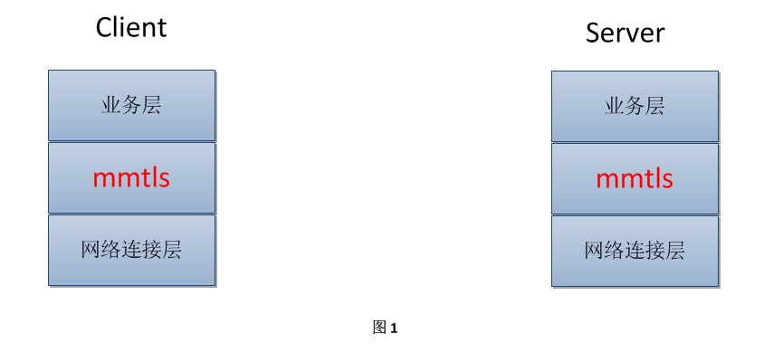
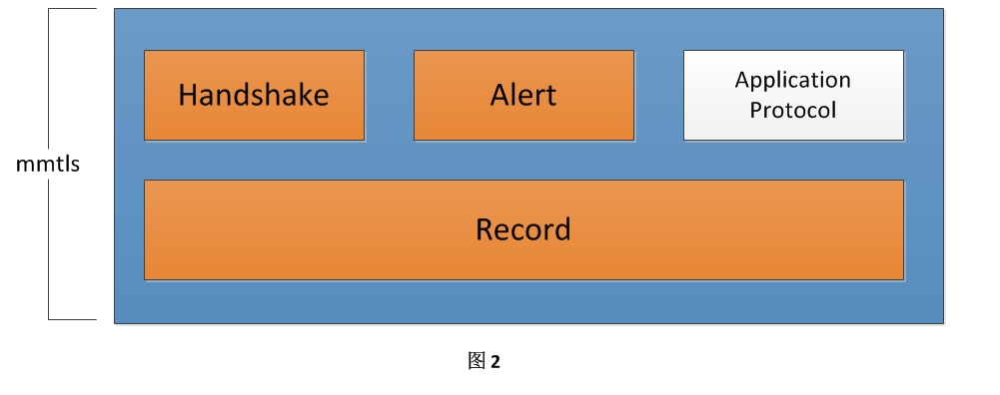
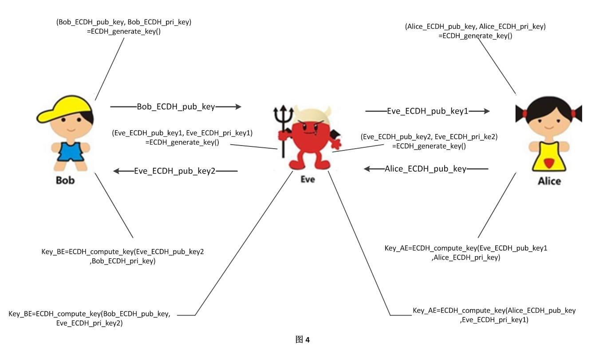
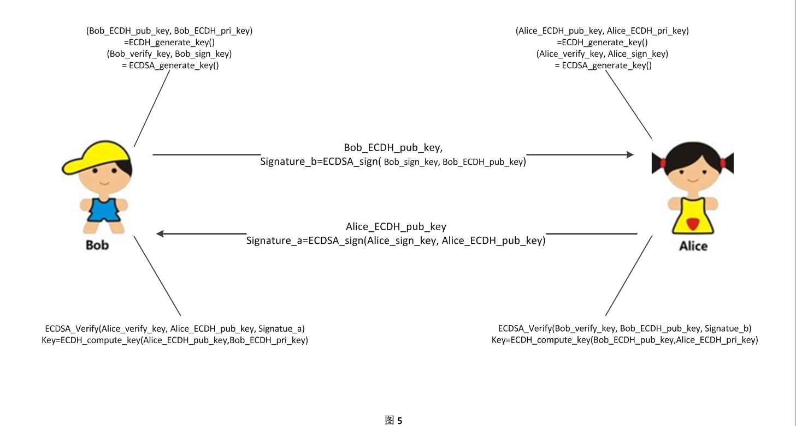
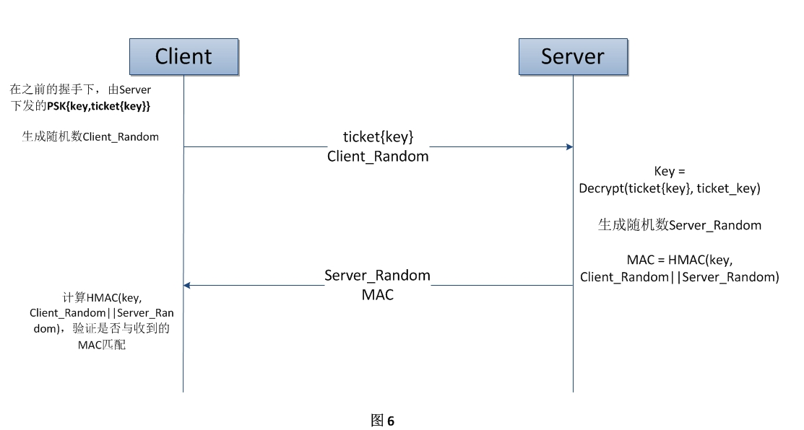
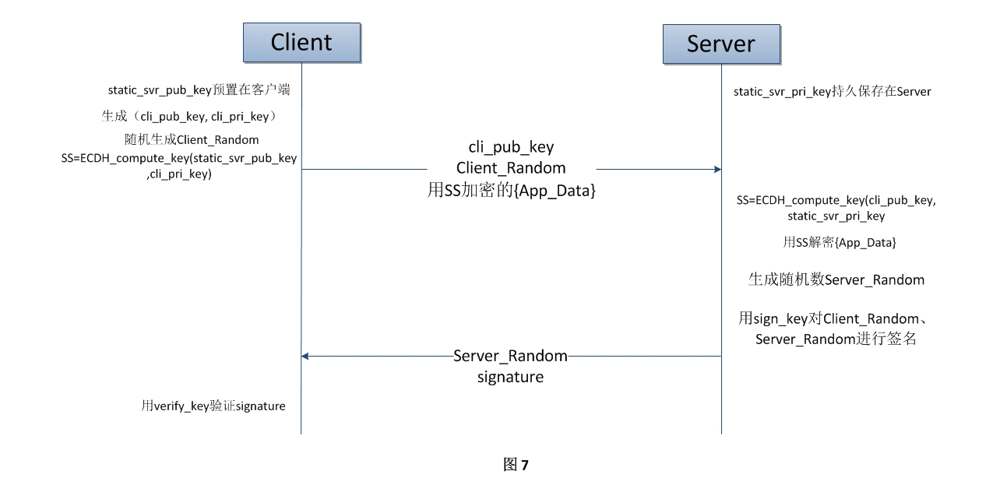
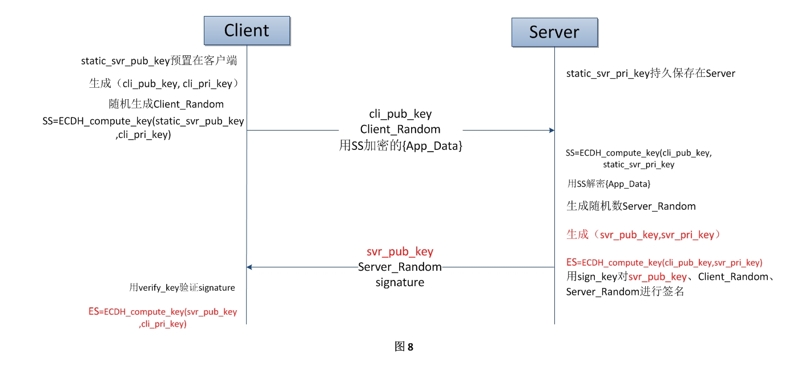
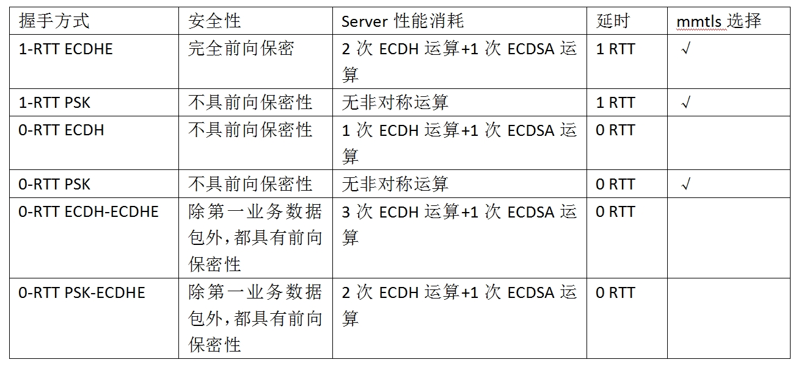
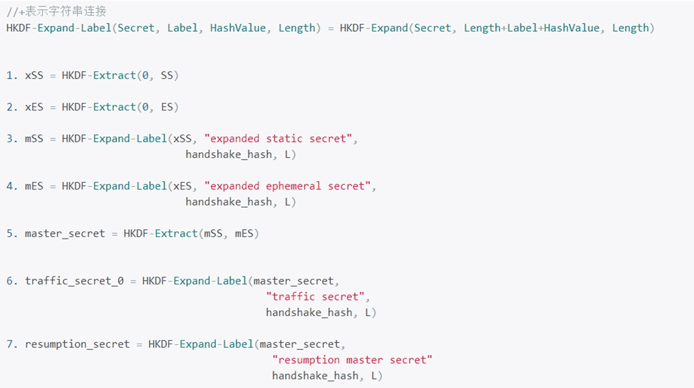

#一、背景 #

　　随着近些年网络安全事情的频繁发生，使得用户对网络通信安全的意识越来越强。国内外的网络服务提供商都逐渐提供全站的安全通信服务，如国内的淘宝、百度先后宣布已经完成了全站部署https。微信现有的安全通信协议是基于用户登录的时候派发的SessionKey对应用数据进行加密的，该协议在工程实现上，已经过多次迭代优化，但是仍然有一些缺点：

1. 原有的加密通信协议是存在于业务层的。加密保护的是请求包包体部分，但是包头部分是明文，包头包含用户id和请求的业务id等信息，这主要是为了在proxy做路由所需要的。这样会存在数据被截获后建立映射关联分析的风险。　
2. 原有的加密通信协议使用的密码学协议和算法与业界最新成果有差距，安全强度有待加强。　
　
　　鉴于上述原因，微信需要一套能够加密保护Client到Server之间所有网络通信数据、且加密通信保护必须对业务开发人员透明的安全通信协议，由此诞生了mmtls。

#二、目标 #

　　考虑到系统安全性与可用性和性能等指标之间可能存在相互影响，某种程度上，安全性与这些指标是负相关的。因此在设计的时候对mmtls提出了以下要求：　

1. 安全性。主要体现在防窃听，防篡改，防重放，防伪造。　
2. 低延迟、低资源消耗。要保证数据在传输过程中不会增加明显的延迟；后台负载增加在可接受范围。　　
3. 可用性。在一些极端情况下（如server负载过高），后台能够控制提供降级服务，但是要注意不能被攻击者利用，进行降级攻击。
4. 可扩展性。协议要可扩展、可升级，方便添加安全强度更高的密码学组件，方便禁止过时的密码学组件。

　　通过分析一些业界公开的安全通信协议发现，它们都不能完全满足我们的要求，例如TLS1.2中每次建立一个安全连接都需要额外的2~1个RTT（全握手需要2-RTT），对于微信这么一个需要频繁网络通信的IM软件来说，这对用户体验的伤害是极大的，尤其是在大量短连接存在的情况下，额外的RTT对用户延迟的影响是相当明显的。好在TLS1.3草案标准中提出了0-RTT（不额外增加网络延时）建立安全连接的方法，另外TLS协议本身通过版本号、CipherSuite、Extension机制提供了良好的可扩展性。但是，TLS1.3草案标准仍然在制定过程中，基于标准的实现更是遥遥无期，并且TLS1.3是一个对所有软件制定的一个通用协议，如果结合微信自己的特点，还有很大的优化空间。因此我们最终选择基于TLS1.3草案标准，设计实现我们自己的安全通信协议mmtls。

#三、mmtls协议设计 #
##3.1 总体架构 ##

　　业务层数据加上mmtls之后，由mmtls提供安全性，保护业务数据，这类似于http加上tls后，变成https，由tls保护http数据。mmtls处于业务层和原有的网络连接层之间，不影响原有的网络策略。对于微信来说这里的网络连接层就是微信长连接（私有协议）和微信短连接（http协议），都是基于TCP的。

　　图1描述的是把mmtls看成一个整体，它所处的位置。进入mmtls内部，它包含三个子协议：Record协议、Handshake协议、Alert协议。这其实是和TLS类似的。它们之间的关系如下图：

　　Handshake和Alert协议是Record协议的上层协议，业务层协议（Application Protocol）也是record协议的上层协议，在Record协议包中有一个字段，用来区分当前这个Record数据包的上层协议是Handshake、Alert还是业务协议数据包。Handshake协议用于完成Client与Server的握手协商，协商出一个对称加密密钥Key以及其他密码材料，用于后续数据加密。Alert协议用于通知对端发生错误，希望对端关闭连接，目前mmtls为了避免server存在过多TCP Time-Wait状态，Alert消息只会server发送给client，由client主动关闭连接。

　　说明：在下文中，会出现多个对称密钥和多个非对称密钥对，在本文中我会给有些密钥取一个专有的名字，以方便理解避免混淆，如:`pre_master_key，pre_shared_key，cli_pub_key，cli_pri_key` 等，凡是类似`xxx_pub_key、xxx_pri_key`这种名字的都是一对非对称公私钥，`sign_key`和`verify_key`是一对签名/验签的密钥，其他的以key结尾的`xxx_key`都是对称密钥。

##3.2 Handshake协议 --- 安全地协商出对称加密密钥 ##
　　Handshake协议其实做的最主要的事情就是完成加密密钥的协商，即让通信双方安全地获得一致的对称密钥，以进行加密数据传输。在此基础上，还完成了一些优化工作，如复用session以减少握手时间。

　　在这里说明一下，为什么mmtls以及TLS协议需要一个Handshake子协议和Record子协议？其实“认证密钥协商+对称加密传输”这种混合加密结构，是绝大多数加密通信协议的通用结构，在mmtls/TLS中Handshake子协议负责密钥协商， Record子协议负责数据对称加密传输。造成这种混合加密结构的本质原因还是因为单独使用公钥加密组件或对称加密组件都有不可避免的缺点。公钥加密组件计算效率往往远低于对称加密组件，直接使用公钥加密组件加密业务数据，这样的性能损耗任何Server都是无法承受的；而如果单独使用对称加密组件进行网络加密通信，在Internet这种不安全的信道下，这个对称加密密钥如何获取往往是一个难以解决的问题，因此结合两类密码组件的优势，产生了“认证密钥协商+对称加密传输”这种混合加密结构。另外，mmtls/TLS这种安全性和扩展性都很强的安全通信协议，在解决实际安全通信问题的时候，会有非常多的细节问题，因此分离出两个子协议来隔离复杂性。
###　　3.2.1 带认证的密钥协商###
　　根据TLS1.3的描述，实际上有2种1-RTT的密钥协商方式（1-RTT ECDHE、 1-RTT PSK）和4种0-RTT的密钥协商方式（0-RTT PSK, 0-RTT ECDH, 0-RTT PSK-ECDHE, 0-RTT ECDH-ECDHE），mmtls结合微信的特点，在保证安全性和性能的前提下，只保留了三种密钥协商方式（1-RTT ECDHE, 1-RTT PSK, 0-RTT PSK），并做了一些优化，后面会详细分析如何产生这种决策的。
####　　3.2.1.1 1-RTT密钥协商####
#####　　1.ECDH密钥协商#####
　　首先看一个，会遭受到攻击的密钥协商过程。通信双方Alice和Bob使用ECDH密钥交换协议进行密钥协商，ECDH密钥交换协议拥有两个算法：

- 密钥生成算法`ECDH_Generate_Key`，输出一个公钥和私钥对`(ECDH_pub_key, ECDH_pri_key)`，`ECDH_pri_key`需要秘密地保存，`ECDH_pub_key`可以公开发送给对方。
- 密钥协商算法`ECDH_compute_key`，以对方的公钥和自己的私钥作为输入，计算出一个密钥Key，`ECDH_compute_key`算法使得通信双方计算出的密钥Key是一致的。

　　这样一来Alice和Bob仅仅通过交换自己的公钥`ECDH_pub_key`，就可以在Internet这种公开信道上共享一个相同密钥Key，然后用这个Key作为对称加密算法的密钥，进行加密通信。

　　但是这种密钥协商算法仍然存在一个问题。当Bob将他的`Bob_ECDH_pub_key`发送给Alice时，攻击者可以截获`Bob_ECDH_pub_key`，自己运行`ECDH_Generate_Key算法`产生一个公钥/私钥对，然后把他产生的公钥发送给Alice。同理，攻击者可以截获Alice发送给Bob的`Alice_ECDH_pub_key`，再运行`ECDH_Generate_Key算法`产生一个公钥/私钥对，并把这个公钥发送给Bob。Alice和Bob仍然可以执行协议，产生一个密钥Key。但实际上，Alice产生的密钥Key实际上是和攻击者Eve协商的；Bob产生的密钥Key也是和攻击者协商Eve的。这种攻击方法被称为中间人攻击（Man In The Middle Attack）。

　　那么，有什么解决办法中间人攻击呢？产生中间人攻击的本质原因是协商过程中的数据没有经过端点认证，通信两端不知道收到的协商数据是来自对端还是来自中间人，因此单纯的“密钥协商”是不够的，还需要“带认证的密钥协商”。对数据进行认证其实有对称和非对称的两种方式：基于消息认证码（Message Authentication Code）的对称认证和基于签名算法的非对称认证。消息认证码的认证方式需要一个私密的Key，由于此时没有一个私密的Key，因此ECDH认证密钥协商就是ECDH密钥协商加上数字签名算法。在mmtls中我们采用的数字签名算法为ECDSA。

　　双方密钥协商时，再分别运行签名算法对自己发出的公钥`ECDH_pub_key`进行签名。收到信息后，首先验证签名，如果签名正确，则继续进行密钥协商。注意到，由于签名算法中的公钥`ECDSA_verify_key`是一直公开的，攻击者没有办法阻止别人获取公钥，除非完全掐断发送方的通信。这样一来，中间人攻击就不存在了，因为Eve无法伪造签名。具体过程如图5所示：

　　事实上，在实际通信过程中，只需要通信中某一方签名它的协商数据就可以保证不被中间人攻击，mmtls就是只对Server做认证，不对Client做认证，因为微信客户端发布出去后，任何人都可以获得，只要能够保证客户端程序本身的完整性，就相当于保证了客户端程序是由官方发布的，为认证合法的客户端，而客户端程序本身的完整性不是mmtls协议保护的范畴。在这一点上，TLS要复杂一些，TLS作为一个通用的安全通信协议，可能会存在一些需要对Client进行认证的场合，因此TLS提供了可选的双方相互认证的能力，通过握手协商过程中选择的CipherSuite是什么类型来决定是否要对Server进行认证，通过Server是否发送CertificateRequest握手消息来决定是否要对Client进行认证。由于mmtls不需要对Client做认证，在这块内容上比TLS简洁许多，更加轻量级。
#####2.PSK密钥协商#####
　　PSK是在一次ECDH握手中由server下发的内容，它的大致数据结构为`PSK{key，ticket{key}}`，即PSK包含一个用来做对称加密密钥的key明文，以及用`ticket_key`对`key`进行加密的密文`ticket`，当然PSK是在安全信道中下发的，也就是说在网络中进行传输的时候PSK是加密的，中间人是拿不到`key`的。其中`ticket_key`只有server才知道，由server负责私密保存。

　　PSK协商比较简单，Client将PSK的`ticket{key}`部分发送给Server，由于只有Server才知道`ticket_key`，因此key是不会被窃听的。Server拿到ticket后，使用`ticket_key`解密得到key，然后Server用基于协商得到的密钥key，对协商数据计算消息认证码来认证，这样就完成了PSK认证密钥协商。PSK认证密钥协商使用的都是对称算法，性能上比ECDH认证密钥协商要好很多。

####　　3.2.1.2 0-RTT密钥协商####
　　上述的两种认证密钥协商方式（1-RTT ECDHE, 1-RTT PSK）都需要一个额外RTT去获取对称加密key，在这个协商的RTT中是不带有业务数据的，全部都是协商数据。那么是否存在一种密钥协商方式是在握手协商的过程中就安全地将业务数据传递给对端呢？答案是有的，TLS1.3草案中提到了0-RTT密钥协商的方法。
#####1. 0-RTT ECDH密钥协商#####
　　0-RTT 握手想要达到的目标是在握手的过程中，捎带业务数据到对端，这里难点是如何在客户端发起协商请求的时候就生成一个可信的对称密钥加密业务数据。在1-RTT ECDHE中，Client生成一对公私钥`(cli_pub_key, cli_pri_key)`，然后将公钥`cli_pub_key`传递给Server，然后Server生成一对公私钥`(svr_pub_key, svr_pri_key)`并将公钥`svr_pub_key`传递给Client，Client收到`svr_pub_key`后才能计算出对称密钥。上述过程`(svr_pub_key, svr_pri_key)`由于是临时生成的，需要一个RTT将`svr_pub_key`传递给客户端，如果我们能够预先生成一对公私钥`(static_svr_pub_key, static_svr_pri_key)`并将`static_svr_pub_key`预置在Client中，那么Client可以在发起握手前就通过`static_svr_pub_ke`和`cli_pub_key`生成一个对称密钥`SS(Static Secret)`，然后用SS加密第一个业务数据包（实际上是通过SS衍生的密钥对业务数据进行加密，后面详述），这样将SS加密的业务数据包和`cli_pub_key`一起传给Server，Server通过`cli_pub_key`和`static_server_private_key`算出SS，解密业务数据包，这样就达到了0-RTT密钥协商的效果。

　　这里说明一下：ECDH协商中，如果公私钥对都是临时生成的，一般称为ECDHE，因此1-RTT的ECDH协商方式被称为1-RTT ECDHE握手，0-RTT 中有一个静态内置的公钥，因此称为0-RTT ECDH握手。
#####　　2. 0-RTT PSK密钥协商#####
　　0-RTT PSK握手比较简单，回顾1-RTT PSK握手，其实在进行1-RTT PSK握手之前，Client已经有一个对称加密密钥key了，就直接拿这个对称加密密钥key加密业务数据，然后将其和握手协商数据`ticket{key}`一起传递给Server就可以了。

#####　　3.提高0-RTT密钥协商的安全性#####
　　PFS（perfect forward secrecy），中文可叫做完全前向保密。它要求一个密钥被破解，并不影响其他密钥的安全性，反映的密钥协商过程中，大致的意思是用来产生会话密钥的长期密钥泄露出去，不会造成之前通信时使用的会话密钥的泄露；或者密钥协商方案中不存在长期密钥，所有协商材料都是临时生成的。

　　上面所述的0-RTT ECDH密钥协商加密的数据的安全性依赖于长期保存的密钥`static_svr_pri_key`，如果`static_svr_pri_key`泄露，那么所有基于0-RTT ECDH协商的密钥SS都将被轻松计算出来，它所加密的数据也没有任何保密性可言，为了提高前向安全性，我们在进行0-RTT ECDH协商的过程中也进行ECDHE协商，这种协商方式称为0-RTT ECDH-ECDHE密钥协商。如下图所示：

　　这样，我们基于`static_svr_pri_key`保护的数据就只有第一个业务数据包AppData，后续的包都是基于ES(Ephemeral Secret)对业务数据进行保护的。这样即使`static_svr_pri_key`泄露，也只有连接的第一个业务数据包能够被解密，提高前向安全性。

　　同样的，0-RTT PSK密钥协商加密的数据的安全性依赖于长期保存密钥`ticket_key`，如果`ticket_key`泄露，那么所有基于`ticket_key`进行保护的数据都将失去保密性，因此同样可以在0-RTT PSK密钥协商的过程中，同时完成ECDHE密钥协商，提高前向安全性。
###　　3.2.2 密钥协商需要关注的细节###
　　根据前面的描述可以知道，要使得密钥协商过程不被中间人攻击，就必须要对协商数据进行认证。下面拿1-RTT ECDHE握手方式来说明在进行认证过程中需要注意的细节。在1-RTT ECDHE中的认证方式是使用ECDSA签名算法的非对称认证方式，整个过程大致如下：Server在收到客户端的`cli_pub_key`后，随机生成一对ECDH公私钥`（svr_pub_key, svr_pri_key）`，然后用签名密钥`sign_key`对`svr_pub_key`进行签名，得到签名值Signature，并把签名值Signature和`svr_pub_key`一起发送给客户端。客户端收到之后，用`verify_key`进行验签（`verify_key`和`sign_key`是一对ECDSA密钥），验签成功后才会继续走协商对称密钥的流程。

　　上面的认证过程，有三个值得关注的点：

- Verify_Key如何下发给客户端？

　　这实际上是公钥派发的问题，TLS是使用证书链的方式来派发公钥（证书），对于微信来说，如果使用证书链的方式来派发Server的公钥（证书），无论自建Root CA还是从CA处申请证书，都会增加成本且在验签过程中会存在额外的资源消耗。由于客户端是由我们自己发布的，我们可以将`verify_key`直接内置在客户端，这样就避免证书链验证带来的时间消耗以及证书链传输带来的带宽消耗。

- 如何避免签名密钥`sign_key`泄露带来的影响？

　　如果`sign_key`泄露，那么任何人都可以伪造成Server欺骗Client，因为它拿到了`sign_key`，它就可以签发任何内容，Client用`verify_key`去验证签名必然验签成功。因此`sign_key`如果泄露必须要能够对`verify_key`进行撤销，重新派发新的公钥。这其实和前一问题是紧密联系的，前一问题是公钥派发问题，本问题是公钥撤销问题。TLS是通过CRL和OCSP两种方式来撤销公钥的，但是这两种方式存在撤销不及时或给验证带来额外延迟的副作用。由于mmtls是通过内置·verify_key·在客户端，必要时通过强制升级客户端的方式就能完成公钥撤销及更新。另外，`sign_key`是需要Server高度保密的，一般不会被泄露，对于微信后台来说，类似于`sign_key`这样，需要长期私密保存的密钥在之前也有存在，早已形成了一套方法和流程来应对长期私密保存密钥的问题。

- 用`sign_key`进行签名的内容仅仅只包含`svr_pub_key`是否有隐患？

　　回顾一下，上面描述的带认证的ECDH协商过程，似乎已经足够安全，无懈可击了，但是，面对成亿的客户端发起ECDH握手到成千上万台接入层机器，每台机器对一个TCP连接随机生成不同的ECDH公私钥对，这里试想一种情况，假设某一台机器某一次生成的ECDH私钥`svr_pri_key1`泄露，这实际上是可能的，因为临时生成的ECDH公私钥对本身没有做任何保密保存的措施，是明文、短暂地存放在内存中，一般情况没有问题，但在分布式环境，大量机器大量随机生成公私钥对的情况下，难保某一次不被泄露。这样用`sign_key`（`sign_key`是长期保存，且分布式环境共享的）对`svr_pub_key1`进行签名得到签名值Signature1，此时攻击者已经拿到`svr_pri_key1，svr_pub_key1和Signature1`，这样他就可以实施中间人攻击，让客户端每次拿到的服务器ECDH公钥都是`svr_pub_key1`：客户端随机生成ECDH公私钥对（`cli_pub_key, cli_pri_key）`并将`cli_pub_key`发给Server，中间人将消息拦截下来，将`client_pub_key`替换成自己生成的`client_pub_key’`，并将`svr_pub_key1`和Signature1回给Client，这样Client就通过计算`ECDH_Compute_Key(svr_pub_key1, cli_pri_key)=Key1`, Server通过计算`ECDH_Compute_Key(client_pub_key’, svr_pub_key)=Key’`，中间人既可以计算出Key1和Key’，这样它就可以用Key1和Client通信，用Key’和Server进行通信。发生上述被攻击的原因在于一次握手中公钥的签名值被用于另外一次握手中，如果有一种方法能够使得这个签名值和一次握手一一对应，那么就能解决这个问题。解决办法也很简单，就是在握手请求的ClientHello消息中带一个`Client_Random`随机值，然后在签名的时候将`Client_Random`和`svr_pub_key`一起做签名，这样得到的签名值就与`Client_Random`对应了。mmtls在实际处理过程中，为了避免Client的随机数生成器有问题，造成生成不够随机的Client_Random，实际上Server也会生成一个随机数`Server_Random`，然后在对公钥签名的时候将`Client_Random、Server_Random、svr_pub_key`一起做签名，这样由`Client_Random、Server_Random`保证得到的签名值唯一对应一次握手。

###　　3.2.3  mmtls对认证密钥协商的选择###
　　上面一共介绍了2种1-RTT 密钥协商方式和4种0-RTT 密钥协商方式。

　　PSK握手全程无非对称运算，Server性能消耗小，但前向安全性弱，ECDHE握手有非对称运算，Server性能消耗大，但前向安全性相对更强，那么如何结合两者优势进行密钥协商方式的选择呢？

　　首先PSK是如何获得的呢？PSK是在一次成功的ECDH(E)握手中下发的（在上面的图7、图8没有画出下发PSK的部分），如果客户端没有PSK，那么显然是只能进行ECDH(E)握手了。由于PSK握手和ECDH(E)握手的巨大性能差异，那么在Client有PSK的情况下，应该进行PSK握手。那么在没有PSK的情况下，上面的1-RTT ECDHE、0-RTT ECDH、0-RTT ECDH-ECDHE具体应该选择哪一种呢？在有PSK的情况下，应该选择1-RTT PSK、0-RTT PSK还是0-RTT PSK-ECDHE呢？

　　对于握手方式的选择，我们也是几经过修改，最后结合微信网络连接的特点，我们选择了1-RTT ECDHE握手、1-RTT PSK握手、0-RTT PSK握手。微信目前有两个数据传输通道：1.基于HTTP协议的短连接 2.基于私有协议的长连接。

　　微信长连接有一个特点，就是在建立好TCP连接之后，会在此TCP连接上先发一个长连nooping包，目的是验证长连接的连通性（由于长连接是私有协议，部分中间路由会过滤掉这种私有协议的数据包），这就是说长连接在建立时的第一个数据包是不会发送业务数据的，因此使用1-RTT的握手方式，由第一个握手包取代之前的nooping包去探测长连的连通性，这样并不会增加长连的网络延时，因此我们选取在长连接情况下，使用1-RTT ECDHE和1-RTT PSK这两种密钥协商方式。

　　微信短连接为了兼容老版本的HTTP协议，整个通信过程就只有一个RTT，也就是说Client建立TCP连接后，通过HTTP POST一个业务请求包到Server，Server回一个HTTP响应，Client处理后立马断掉TCP连接。对于短连接，我们应该尽量使用0-RTT的握手方式，因为一个短连接原来就只存在一个RTT，如果我们大量使用1-RTT的握手方式，那么直接导致短连接至少需要2个RTT才能完成业务数据的传输，导致时延加倍，用户体验较差。这里存在两种情况：(1)客户端没有PSK，为了安全性，这时和长连接的握手方式一样，使用1-RTT ECDHE；(2)客户端有PSK，这时为了减少网络时延，应该使用0-RTT PSK或0-RTT PSK-ECDHE，在这两种握手方式下，由于业务请求包始终是基于PSK进行保护的，同一个PSK多次协商出来的对称加密key是同一个，这个对称加密key的安全性依赖于`ticket_key`的安全性，因此0-RTT情况下，业务请求包始终是无法做到前向安全性。0-RTT PSK-ECDHE这种方式，只能保证本短连接业务响应回包的前向安全性，这带来安全性上的优势是比较小的，但是与0-RTT PSK握手方式相比，0-RTT PSK-ECDHE在每次握手对server会多2次ECDH运算和1次ECDSA运算。微信的短连接是非常频繁的，这对性能影响极大，因此综合考虑，在客户端有PSK的情况下，我们选择使用0-RTT PSK握手。由于0-RTT PSK握手安全性依赖`ticket_key`，为了加强安全性，在实现上，PSK必须要限制过期时间，避免长期用同一个PSK来进行握手协商；`ticket_key`必须定期轮换，且具有高度机密的运维级别。

　　另外，为了提高系统可用性，实际上mmtls在一次成功的ECDH握手中会下发两个PSK，一个生命周期短保证安全性，一个生命周期长保证可用性。在一次ECDH握手中，请求会带上生命周期长的PSK（如果存在的话），后台可根据负载情况进行权衡，选择使用ECDH握手或者PSK握手。

##3.3 Record协议 --- 使用对称加密密钥进行安全的通信 ##
　　经过上面的Handshake过程，此时Client和Server已经协商出了一致的对称加密密钥`pre_master_key`，那么接下来就可以直接用这个`pre_master_key`作为密钥，选择一种对称加密算法（如常用的AES-CBC）加密业务数据，将密文发送给Server。是否真的就这么简单呢？实际上如果真的按这个过程进行加密通信是有很多安全漏洞的。

###　　3.3.1 认证加密（Authenticated Encryption）###
　　“加密并不是认证”在密码学中是一个简单的共识，但对于我们很多程序员来说，并不知道这句话的意义。加密是隐藏信息，使得在没有正确密钥的情况下，信息变得难以读懂，加密算法提供保密性，上面所述的AES-CBC这种算法只是提供保密性，即防止信息被窃听。在信息安全领域，消息认证（message authentication）或数据源认证（data origin authentication）表示数据在传输过程中没有被修改（完整性），并且接收消息的实体能够验证消息的源（端点认证）。AES-CBC这种加密算法只提供保密性，但是并不提供完整性。这似乎有点违反直觉，好像对端发给我一段密文，如果我能够解密成功，通过过程就是安全的，实则不然，就拿AES-CBC加密一段数据，如果中间人篡改部分密文，只要不篡改padding部分，大部分时候仍旧能够正常解密，只是得到的明文和原始明文不一样。现实中也有对消息追加CRC校验来解决密文被篡改问题的，实际上经过精心构造，即使有CRC校验仍然能够被绕过。本质的原因是在于进行加密安全通信过程，只使用了提供保密性的对称加密组件，没有使用提供消息完整性的密码学组件。因此只要在用对称加密算法加密明文后，再用消息认证码算法对密文计算一次消息认证码，将密文和消息认证码发送给Server，Server进行验证，这样就能保证安全性了。实际上加密过程和计算消息认证码的过程，到底应该如何组合，谁先谁后，在密码学发展的历史上先后出现了三种组合方式：（1）Encrypt-and-MAC （2）MAC-then-Encrypt （3）Encrypt-then-MAC，根据最新密码学动态，目前学术界已经一致同意Encrypt-then-MAC是最安全的，也就是先加密后算消息认证码的方式。鉴于这个陷阱如此险恶，因此就有人提出将Encrypt和MAC直接集成在一个算法内部，让有经验的密码专家在算法内部解决安全问题，不让算法使用者选择，这就是这就是AEAD（Authenticated-Encryption With Addtional data）类的算法。TLS1.3彻底禁止AEAD以外的其他算法。mmtls经过综合考虑，选择了使用AES-GCM这种AEAD类算法，作为协议的认证加密组件，而且AES-GCM也是TLS1.3要求必须实现的算法。

###　　3.3.2 密钥扩展###
　　TLS1.3明确要求通信双方使用的对称加密Key不能完全一样，否则在一些对称加密算法下会被完全攻破，即使是使用AES-GCM算法，如果通信双方使用完全相同的加密密钥进行通信，在使用的时候也要小心翼翼的保证一些额外条件，否则会泄露部分明文信息。另外，AES算法的初始化向量（IV）如何构造也是很有讲究的，一旦用错就会有安全漏洞。也就是说，对于handshake协议协商得到的`pre_master_secret`不能直接作为双方进行对称加密密钥，需要经过某种扩展变换，得到六个对称加密参数：

	　　Client Write MAC Key    （用于Client算消息认证码，以及Server验证消息认证码）
	　　Server Write MAC Key	 （用于Server算消息认证码，以及Client验证消息认证码）
	　　Client Write Encryption Key（用做Client做加密，以及Server解密）
	　　Server Write Encryption Key（用做Server做加密，以及Client解密）
	　　Client Write IV  （Client加密时使用的初始化向量）
	　　Server Write IV  （Server加密时使用的初始化向量）
　　当然，使用AES-GCM作为对称加密组件，MAC Key和Encryption Key只需要一个就可以了。

　　握手生成的`pre_master_secret`只有48个字节，上述几个加密参数的长度加起来肯定就超过48字节了，所以需要一个函数来把48字节延长到需要的长度，在密码学中专门有一类算法承担密钥扩展的功能，称为密钥衍生函数（Key Derivation Function）。TLS1.3使用的HKDF做密钥扩展，mmtls也是选用的HKDF做密钥扩展。

　　在前文中，我用`pre_master_secret`代表握手协商得到的对称密钥，在TLS1.2之前确实叫这个名字，但是在TLS1.3中由于需要支持0-RTT握手，协商出来的对称密钥可能会有两个，分别称为Static Secret(SS)和Ephemeral Secret（ES）。从TLS1.3文档中截取一张图进行说明一下：

　　上图中Key Exchange就是代表握手的方式，在1-RTT ECDHE握手方式下，

	ES=SS = ECDH_Compute_Key(svr_pub_key, cli_pri_key);

　　在0-RTT ECDH下,

	SS=ECDH_Compute_Key(static_svr_pub_key, cli_pri_key), 
	ES=ECDH_Compute_Key(svr_pub_Key, cli_pri_Key);
　　在0-RTT/1-RTT PSK握手下，

	ES=SS=pre-shared key;
　　在0-RTT PSK-ECDHE握手下，

	SS=pre-shared key，
	ES=ECDH_Compute_Key(svr_pub_key, cli_pri_key);

　　前面说过mmtls使用的密钥扩展组件为HKDF，该组件定义了两个函数来保证扩展出来的密钥具有伪随机性、唯一性、不能逆推原密钥、可扩展任意长度密钥。两个函数分别是：

	HKDF-Extract( salt, initial-keying-material )

　　该函数的作用是对initial-keying-material进行处理，保证它的熵均匀分别，足够的伪随机。

	HKDF-Expand( pseudorandom key, info, out_key_length )

　　参数pseudorandom key是已经足够伪随机的密钥扩展材料，HKDF-Extract的返回值可以作为`pseudorandom key`，`info`用来区分扩展出来的Key是做什么用，`out_key_length`表示希望扩展输出的key有多长。mmtls最终使用的密钥是有HKDF-Expand扩展出来的。mmtls把info参数分为：`length，label，handshake_hash`。其中length等于`out_key_length`，`label`是标记密钥用途的固定字符串，`handshake_hash`表示握手消息的hash值，这样扩展出来的密钥保证连接内唯一。

　　TLS1.3草案中定义的密钥扩展方式比较繁琐，如上图所示。为了得到最终认证加密的对称密钥，需要做3次HDKF-Extract和4次HKDF-Expand操作，实际测试发现，这种密钥扩展方式对性能影响是很大的，尤其在PSK握手情况（PSK握手没有非对称运算）这种密钥扩展方式成为性能瓶颈。TLS1.3之所以把密钥扩展搞这么复杂，本质上还是因为TLS1.3是一个通用的协议框架，具体的协商算法是可以选择的，在有些协商算法下，协商出来的`pre_master_key`（SS和ES）就不满足某些特性（如随机性不够），因此为了保证无论选择什么协商算法，用它来进行通信都是安全的，TLS1.3就在密钥扩展上做了额外的工作。而mmtls没有TLS1.3这种包袱，可以针对微信自己的网络通信特点进行优化（前面在握手方式选择上就有体现）。mmtls在不降低安全性的前提下，对TLS1.3的密钥扩展做了精简，使得性能上较TLS1.3的密钥扩展方式有明显提升。

　　在mmtls中，`pre_master_key`(SS和ES)经过密钥扩展，得到了一个长度为`2*enc_key_length+2*iv_length`的一段buffer，用`key_block`表示，其中：

	　　client_write_key = key_block[0...enc_key_length-1]
	　　client_write_key = key_block[enc_key_length...2*enc_key_length-1]
	　　client_write_IV  = key_block[2*enc_key_length...2*enc_key_length+iv_length-1]
	　　server_write_IV  = key_block[2*enc_key_length+iv_length...2*enc_key_length+2*iv_length-1]

###　　3.3.3 防重放###

　　重放攻击（Replay Attacks）是指攻击者发送一个接收方已经正常接收过的包，由于重防的数据包是过去的一个有效数据，如果没有防重放的处理，接收方是没办法辨别出来的。防重放在有些业务是必须要处理的，比如：如果收发消息业务没有做防重放处理，就会出现消息重复发送的问题；如果转账业务没有做防重放处理，就会重现重复转账问题。微信在一些关键业务层面上，已经做了防重放的工作，但如果mmtls能够在下层协议上就做好防重放，那么就能有效减轻业务层的压力，同时为目前没有做防重放的业务提供一个安全保障。
　　

　　防重放的解决思路是为连接上的每一个业务包都编一个递增的sequence number，这样只要服务器检查到新收到的数据包的sequence number小于等于之前收到的数据包的sequence number，就可以断定新收到的数据包为重放包。当然sequence number是必须要经过认证的，也就是说sequence number要不能被篡改，否则攻击者把sequence number改大，就绕过这个防重放检测逻辑了。可以将sequence number作为明文的一部分，使用AES-GCM进行认证加密，明文变长了，不可避免的会增加一点传输数据的长度。实际上，mmtls的做法是将sequence number作为构造AES-GCM算法参数nonce的一部分，利用AES-GCM的算法特性，只要AES-GCM认证解密成功就可以确保sequence number符合预期。

　　上述防重放思路在1-RTT的握手方式下是没有问题的，因为在1-RTT握手下，第一个RTT是没有业务数据的，可以在这个RTT下由Client和Server共同决定开始计算sequence number的起点。但是在0-RTT的握手方式，第一个业务数据包和握手数据包一起发送给服务器，对于这第一个数据包的防重放，Server只能完全靠Client发来的数据来判断是否重放，如果客户端发送的数据完全由自己生成，没有包含服务器参与的标识，那么这份数据是无法判断是否为重放数据包的。在TLS1.3给了一个思路来解决上述这个“0-RTT跨连接重放的问题”：在Server处保存一个跨连接的全局状态，每新建一个连接都更新这个全局状态，那么0-RTT握手带来的第一个业务数据也可以由这个跨连接的全局状态来判断是否重放。但是，在一个分布式系统中每新建一个连接都读写这个全局状态，如此频繁的读写，无疑在可用性和性能消耗上都不可接受。事实上，0-RTT跨连接防重放确实困难，目前没有比较通用、高效的方案。其实在Google的QUIC crypto protocol中也存在0-RTT跨连接重放的问题，由于QUIC主要应用在Chrome浏览器上，在浏览器上访问网站时，建连接的第一个请求一般是GET而不是POST，所以0-RTT加密的数据不涉及多少敏感性，被重放也只是刷新一次页面而已，所以其选择了不解决0-RTT防重放的问题。但是微信短连接是POST请求，带给Server的都是上层的业务数据，因此0-RTT防重放是必须要解决的问题。mmtls根据微信特有的后台架构，提出了基于客户端和服务器端时间序列的防重放策略，mmtls能够保证超过一段时间T的重放包被服务器直接解决，而在短时间T内的重放包需要业务框架层来协调支持防重放，这样通过proxy层和logic框架层一起来解决0-RTT PSK请求包防重放问题，限于篇幅，详细方案此处不展开介绍。
#四、小结 #

　　mmtls是参考TLS1.3草案标准设计与实现的，使用ECDH来做密钥协商，ECDSA进行签名验证，AES-GCM作为对称加密算法来对业务数据包进行认证加密，使用HKDF进行密钥扩展，摘要算法为SHA256。另外，结合具体的使用场景，mmtls在TLS1.3的基础上主要做了以下几方面的工作：
　　

1. 轻量级。砍掉了客户端认证相关的内容；直接内置签名公钥，避免证书交换环节，减少验证时网络交换次数。　
2. 安全性。选用的基础密码组件均是TLS1.3推荐、安全性最高的密码组件；0-RTT防重放由proxy层和logic框架层协同控制。　　
3. 高性能。使用0-RTT握手方式没有增加原有Client和Server的交互次数；和TLS1.3比，优化了握手方式和密钥扩展方式。　
4. 高可用性。服务器的过载保护，确保服务器能够在容灾模式下提供安全级别稍低的有损服务。

#五、参考资料 #
1. [TLS协议分析与现代加密通信协议设计](http://blog.helong.info/blog/2015/09/06/tls-protocol-analysis-and-crypto-protocol-design/)
2. [RFC5246](https://tools.ietf.org/html/rfc5246)
3. [The Transport Layer Security (TLS) Protocol Version 1.3](https://tlswg.github.io/tls13-spec/)