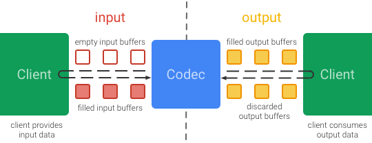
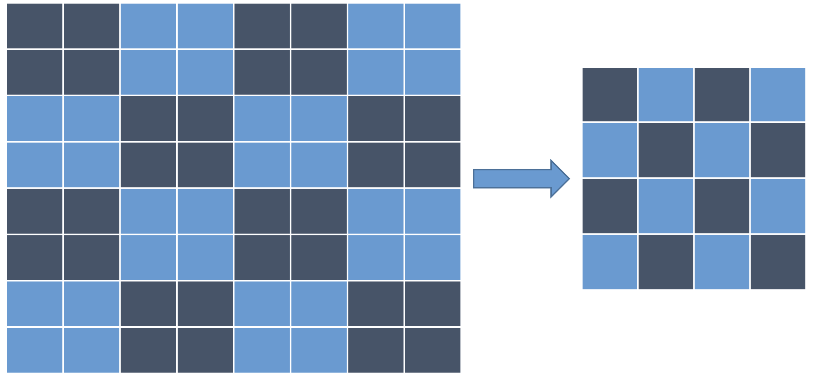

Android的视频相关的开发，大概一直是整个Android生态，以及Android API中，最为分裂以及兼容性问题最为突出的一部分。摄像头，以及视频编码相关的API，Google一直对这方面的控制力非常差，导致不同厂商对这两个API的实现有不少差异，而且从API的设计来看，一直以来优化也相当有限，甚至有人认为这是“Android上最难用的API之一”

以微信为例，我们录制一个540p的mp4文件，对于Android来说，大体上是遵循这么一个流程：

----


----

大体上就是从摄像头输出的YUV帧经过预处理之后，送入编码器，获得编码好的h264视频流。

上面只是针对视频流的编码，另外还需要对音频流单独录制，最后再将视频流和音频流进行合成出最终视频。

这篇文章主要将会对视频流的编码中两个常见问题进行分析：

1. 视频编码器的选择（硬编 or 软编）？
2. 如何对摄像头输出的YUV帧进行快速预处理（镜像，缩放，旋转）？

----
### 视频编码器的选择
对于录制视频的需求，不少app都需要对每一帧数据进行单独处理，因此很少会直接用到``MediaRecorder``来直接录取视频，一般来说，会有这么两个选择

- MediaCodec
- FFMpeg+x264/openh264

我们来逐个解析一下

---
#### MediaCodec

MediaCodec是API 16之后Google推出的用于音视频编解码的一套偏底层的API，可以直接利用硬件加速进行视频的编解码。调用的时候需要先初始化MediaCodec作为视频的编码器，然后只需要不停传入原始的YUV数据进入编码器就可以直接输出编码好的h264流，整个API设计模型来看，就是同时包含了输入端和输出端的两条队列：



因此，作为编码器，输入端队列存放的就是原始YUV数据，输出端队列输出的就是编码好的h264流，作为解码器则对应相反。在调用的时候，MediaCodec提供了同步和异步两种调用方式，但是异步使用Callback的方式是在API 21之后才加入的，以同步调用为例，一般来说调用方式大概是这样（摘自官方例子）：

```Java
 MediaCodec codec = MediaCodec.createByCodecName(name);
 codec.configure(format, …);
 MediaFormat outputFormat = codec.getOutputFormat(); // option B
 codec.start();
 for (;;) {
   int inputBufferId = codec.dequeueInputBuffer(timeoutUs);
   if (inputBufferId >= 0) {
     ByteBuffer inputBuffer = codec.getInputBuffer(…);
     // fill inputBuffer with valid data
     …
     codec.queueInputBuffer(inputBufferId, …);
   }
   int outputBufferId = codec.dequeueOutputBuffer(…);
   if (outputBufferId >= 0) {
     ByteBuffer outputBuffer = codec.getOutputBuffer(outputBufferId);
     MediaFormat bufferFormat = codec.getOutputFormat(outputBufferId); // option A
     // bufferFormat is identical to outputFormat
     // outputBuffer is ready to be processed or rendered.
     …
     codec.releaseOutputBuffer(outputBufferId, …);
   } else if (outputBufferId == MediaCodec.INFO_OUTPUT_FORMAT_CHANGED) {
     // Subsequent data will conform to new format.
     // Can ignore if using getOutputFormat(outputBufferId)
     outputFormat = codec.getOutputFormat(); // option B
   }
 }
 codec.stop();
 codec.release();
```
简单解释一下，通过``getInputBuffers``获取输入队列，然后调用``dequeueInputBuffer``获取输入队列空闲数组下标，注意``dequeueOutputBuffer``会有几个特殊的返回值表示当前编解码状态的变化，然后再通过``queueInputBuffer``把原始YUV数据送入编码器，而在输出队列端同样通过``getOutputBuffers``和``dequeueOutputBuffer``获取输出的h264流，处理完输出数据之后，需要通过``releaseOutputBuffer``把输出buffer还给系统，重新放到输出队列中。<br />
关于MediaCodec更复杂的使用例子，可以参照下CTS测试里面的使用方式：[EncodeDecodeTest.java](https://android.googlesource.com/platform/cts/+/jb-mr2-release/tests/tests/media/src/android/media/cts/EncodeDecodeTest.java)

从上面例子来看的确是非常原始的API，由于MediaCodec底层是直接调用了手机平台硬件的编解码能力，所以速度非常快，但是因为Google对整个Android硬件生态的掌控力非常弱，所以这个API有很多问题：

1. 颜色格式问题

	MediaCodec在初始化的时候，在``configure``的时候，需要传入一个MediaFormat对象，当作为编码器使用的时候，我们一般需要在MediaFormat中指定视频的宽高，帧率，码率，I帧间隔等基本信息，除此之外，还有一个重要的信息就是，指定编码器接受的YUV帧的颜色格式。这个是因为由于YUV根据其采样比例，UV分量的排列顺序有很多种不同的颜色格式，而对于Android的摄像头在``onPreviewFrame``输出的YUV帧格式，如果没有配置任何参数的情况下，基本上都是NV21格式，但Google对MediaCodec的API在设计和规范的时候，显得很不厚道，过于贴近Android的HAL层了，导致了NV21格式并不是所有机器的MediaCodec都支持这种格式作为编码器的输入格式！
	因此，在初始化MediaCodec的时候，我们需要通过``codecInfo.getCapabilitiesForType``来查询机器上的MediaCodec实现具体支持哪些YUV格式作为输入格式，一般来说，起码在4.4+的系统上，这两种格式在大部分机器都有支持：

	```Java
	MediaCodecInfo.CodecCapabilities.COLOR_FormatYUV420Planar
	MediaCodecInfo.CodecCapabilities.COLOR_FormatYUV420SemiPlanar
	```

	两种格式分别是YUV420P和NV21，如果机器上只支持YUV420P格式的情况下，则需要先将摄像头输出的NV21格式先转换成YUV420P，才能送入编码器进行编码，否则最终出来的视频就会花屏，或者颜色出现错乱

	这个算是一个不大不小的坑，基本上用上了MediaCodec进行视频编码都会遇上这个问题
	
2. 编码器支持特性相当有限

	如果使用MediaCodec来编码H264视频流，对于H264格式来说，会有一些针对压缩率以及码率相关的视频质量设置，典型的诸如Profile(baseline, main, high)，Profile Level, Bitrate mode(CBR, CQ, VBR)，合理配置这些参数可以让我们在同等的码率下，获得更高的压缩率，从而提升视频的质量，Android也提供了对应的API进行设置，可以设置到MediaFormat中这些设置项:
	
	```Java
	MediaFormat.KEY_BITRATE_MODE
	MediaFormat.KEY_PROFILE
	MediaFormat.KEY_LEVEL
	```
	
	但问题是，对于Profile，Level, Bitrate mode这些设置，在大部分手机上都是不支持的，即使是设置了最终也不会生效，例如设置了Profile为high，最后出来的视频依然还会是Baseline....
	
	这个问题，在7.0以下的机器几乎是必现的，其中一个可能的原因是，Android在源码层级[hardcode](http://androidxref.com/6.0.1_r10/xref/frameworks/av/media/libstagefright/ACodec.cpp)了profile的的设置：
	
	```Java
	// XXX
    if (h264type.eProfile != OMX_VIDEO_AVCProfileBaseline) {
        ALOGW("Use baseline profile instead of %d for AVC recording",
            h264type.eProfile);
        h264type.eProfile = OMX_VIDEO_AVCProfileBaseline;
    }
	```
	
	Android直到[7.0](http://androidxref.com/7.0.0_r1/xref/frameworks/av/media/libstagefright/ACodec.cpp)之后才取消了这段地方的Hardcode
	
	```Java
	if (h264type.eProfile == OMX_VIDEO_AVCProfileBaseline) {
        ....
    } else if (h264type.eProfile == OMX_VIDEO_AVCProfileMain ||
            h264type.eProfile == OMX_VIDEO_AVCProfileHigh) {
        .....
    }
	```
	
	这个问题可以说间接导致了MediaCodec编码出来的视频质量偏低，同等码率下，难以获得跟软编码甚至iOS那样的视频质量。	
	
3. 16位对齐要求

	前面说到，MediaCodec这个API在设计的时候，过于贴近HAL层，这在很多Soc的实现上，是直接把传入MediaCodec的buffer，在不经过任何前置处理的情况下就直接送入了Soc中。而在编码h264视频流的时候，由于h264的编码块大小一般是16x16，于是乎在一开始设置视频的宽高的时候，如果设置了一个没有对齐16的大小，例如960x540，在某些cpu上，最终编码出来的视频就会直接**花屏**！
	
	很明显这还是因为厂商在实现这个API的时候，对传入的数据缺少校验以及前置处理导致的，目前来看，华为，三星的Soc出现这个问题会比较频繁，其他厂商的一些早期Soc也有这种问题，一般来说解决方法还是在设置视频宽高的时候，统一设置成对齐16位之后的大小就好了。

----
#### FFMpeg+x264/openh264
	
除了使用MediaCodec进行编码之外，另外一种比较流行的方案就是使用ffmpeg+x264/openh264进行软编码，ffmpeg是用于一些视频帧的预处理。这里主要是使用x264/openh264作为视频的编码器。

x264基本上被认为是当今市面上最快的商用视频编码器，而且基本上所有h264的特性都支持，通过合理配置各种参数还是能够得到较好的压缩率和编码速度的，限于篇幅，这里不再阐述h264的参数配置，有兴趣可以看下[这里](https://www.nmm-hd.org/d/index.php?title=X264%E4%BD%BF%E7%94%A8%E4%BB%8B%E7%BB%8D&variant=zh-cn)和[这里](http://www.cnblogs.com/wainiwann/p/5647521.html)对x264编码参数的调优。

[openh264](https://github.com/cisco/openh264)则是由思科开源的另外一个h264编码器，项目在2013年开源，对比起x264来说略显年轻，不过由于思科支付满了h264的年度专利费，所以对于外部用户来说，相当于可以直接免费使用了，另外，firefox直接内置了openh264，作为其在webRTC中的视频的编解码器使用。

但对比起x264，openh264在h264高级特性的支持比较差：

-	Profile只支持到baseline, level 5.2
-   多线程编码只支持slice based，不支持frame based的多线程编码

从编码效率上来看，openh264的速度也并不会比x264快，不过其最大的好处，还是能够直接免费使用吧。

#### 软硬编对比

从上面的分析来看，硬编的好处主要在于速度快，而且系统自带不需要引入外部的库，但是特性支持有限，而且硬编的压缩率一般偏低，而对于软编码来说，虽然速度较慢，但是压缩率比较高，而且支持的H264特性也会比硬编码多很多，相对来说比较可控。就可用性而言，在4.4+的系统上，MediaCodec的可用性是能够基本保证的，但是不同等级的机器的编码器能力会有不少差别，建议可以根据机器的配置，选择不同的编码器配置。

-----
### YUV帧的预处理

根据最开始给出的流程，在送入编码器之前，我们需要先对摄像头输出的YUV帧进行一些前置处理

1.缩放
	
如果设置了camera的预览大小为1080p的情况下，在``onPreviewFrame``中输出的YUV帧直接就是1920x1080的大小，如果需要编码跟这个大小不一样的视频，我们就需要在录制的过程中，**实时**的对YUV帧进行缩放。
	
以微信为例，摄像头预览1080p的数据，需要编码960x540大小的视频。
	
最为常见的做法是使用ffmpeg这种的sws_scale函数进行直接缩放，效果/性能比较好的一般是选择SWS_FAST_BILINEAR算法：
	
```cpp
mScaleYuvCtxPtr = sws_getContext(
		           srcWidth,
		           srcHeight,
		           AV_PIX_FMT_NV21,
		           dstWidth,
		           dstHeight,
		           AV_PIX_FMT_NV21,
		           SWS_FAST_BILINEAR, NULL, NULL, NULL);
sws_scale(mScaleYuvCtxPtr,
                    (const uint8_t* const *) srcAvPicture->data,
                    srcAvPicture->linesize, 0, srcHeight,
                    dstAvPicture->data, dstAvPicture->linesize);
```

在nexus 6p上，直接使用ffmpeg来进行缩放的时间基本上都需要**40ms+**，对于我们需要录制30fps的来说，每帧处理时间最多就30ms左右，如果光是缩放就消耗了如此多的时间，基本上录制出来的视频只能在15fps上下了。

很明显，直接使用ffmpeg进行缩放是在是太慢了，不得不说swsscale简直就是ffmpeg里面的渣渣，在对比了几种业界常用的算之后，我们最后考虑实现使用这种快速缩放的算法：


	
我们选择一种叫做的**局部均值**算法，前后两行四个临近点算出最终图片的四个像素点，对于源图片的每行像素，我们可以使用Neon直接实现，以缩放Y分量为例：

```asm
	const uint8* src_next = src_ptr + src_stride;
    asm volatile (
      "1:                                          \n"    
        "vld4.8     {d0, d1, d2, d3}, [%0]!        \n"
        "vld4.8     {d4, d5, d6, d7}, [%1]!        \n"
        "subs       %3, %3, #16                    \n"  // 16 processed per loop
        
        "vrhadd.u8   d0, d0, d1                    \n"
        "vrhadd.u8   d4, d4, d5                    \n"
        "vrhadd.u8   d0, d0, d4                    \n"

        "vrhadd.u8   d2, d2, d3                    \n"
        "vrhadd.u8   d6, d6, d7                    \n"
        "vrhadd.u8   d2, d2, d6                    \n"

        "vst2.8     {d0, d2}, [%2]!                    \n"  // store odd pixels
        
        "bgt        1b                             \n"
      : "+r"(src_ptr),          // %0
        "+r"(src_next),         // %1
        "+r"(dst),              // %2
        "+r"(dst_width)         // %3
      :
      : "q0", "q1", "q2", "q3"              // Clobber List
    );
```
上面使用的Neon指令每次只能读取和存储8或者16位的数据，对于多出来的数据，只需要用同样的算法改成用C语言实现即可。

在使用上述的算法优化之后，进行每帧缩放，在Nexus 6p上，只需要不到**5ms**就能完成了，而对于缩放质量来说，ffmpeg的SWS_FAST_BILINEAR算法和上述算法缩放出来的图片进行对比，峰值信噪比（psnr）在大部分场景下大概在**38-40**左右，质量也足够好了。

2.旋转
	
在android机器上，由于摄像头安装角度不同，``onPreviewFrame``出来的YUV帧一般都是旋转了90或者270度，如果最终视频是要竖拍的，那一般来说需要把YUV帧进行旋转。

对于旋转的算法，如果是纯C实现的代码，一般来说是个O（n^2 ） 复杂度的算法，如果是旋转960x540的yuv帧数据，在nexus 6p上，每帧旋转也需要**30ms+**，这显然也是不能接受的。

在这里我们换个思路，能不能不对YUV帧进行旋转？

事实上在mp4文件格式的头部，我们可以指定一个旋转矩阵，具体来说是在**moov.trak.tkhd box**里面指定，视频播放器在播放视频的时候，会在读取这里矩阵信息，从而决定视频本身的旋转角度，位移，缩放等，具体可以参考下苹果的[文档](https://developer.apple.com/library/content/documentation/QuickTime/QTFF/QTFFChap4/qtff4.html#//apple_ref/doc/uid/TP40000939-CH206-18737)

通过ffmpeg，我们可以很轻松的给合成之后的mp4文件打上这个旋转角度：

```cpp
char rotateStr[1024];
sprintf(rotateStr, "%d", rotate);
av_dict_set(&out_stream->metadata, "rotate", rotateStr, 0);
```

于是可以在录制的时候省下一大笔旋转的开销了，excited!


3.镜像

在使用前置摄像头拍摄的时候，如果不对YUV帧进行处理，那么直接拍出来的视频是会**镜像翻转**的，这里原理就跟照镜子一样，从前置摄像头方向拿出来的YUV帧刚好是反的，但有些时候拍出来的镜像视频可能不合我们的需求，因此这个时候我们就需要对YUV帧进行镜像翻转。

但由于摄像头安装角度一般是90或者270度，所以实际上原生的YUV帧是水平翻转过来的，因此做镜像翻转的时候，只需要刚好以中间为中轴，分别上下交换每行数据即可，注意Y跟UV要分开处理，这种算法用Neon实现相当简单：

```asm
asm volatile (
      "1:                                          \n"
        "vld4.8     {d0, d1, d2, d3}, [%2]!        \n"  // load 32 from src
        "vld4.8     {d4, d5, d6, d7}, [%3]!        \n"  // load 32 from dst
        "subs       %4, %4, #32                    \n"  // 32 processed per loop
        "vst4.8     {d0, d1, d2, d3}, [%1]!        \n"  // store 32 to dst
        "vst4.8     {d4, d5, d6, d7}, [%0]!        \n"  // store 32 to src
        "bgt        1b                             \n"
      : "+r"(src),   // %0
        "+r"(dst),   // %1
        "+r"(srcdata), // %2
        "+r"(dstdata), // %3
        "+r"(count)  // %4  // Output registers
      :                     // Input registers
      : "cc", "memory", "q0", "q1", "q2", "q3"  // Clobber List
    );
```

同样，剩余的数据用纯C代码实现就好了， 在nexus6p上，这种镜像翻转一帧1080x1920 YUV数据大概只要不到**5ms**

-----

在编码好h264视频流之后，最终处理就是把音频流跟视频流合流然后包装到mp4文件，这部分我们可以通过系统的[MediaMuxer](https://developer.android.com/reference/android/media/MediaMuxer.html)，[mp4v2](https://code.google.com/archive/p/mp4v2/)，或者ffmpeg来实现，这部分比较简单，在这里就不再阐述了

-----

### References

1. [雷霄骅(leixiaohua1020)的专栏](http://blog.csdn.net/leixiaohua1020) ，大名鼎鼎雷神的博客，里面有非常多关于音视频编码/ffmpeg相关的学习资料，入门必备。也祝愿他能够在天堂安息吧
2. [Android MediaCodec stuff](http://bigflake.com/mediacodec/)，包含了一些MediaCodec使用的示例代码，初次使用可以参考下这里
3. [Coding for NEON](https://community.arm.com/processors/b/blog/posts/coding-for-neon---part-1-load-and-stores)，一个系列教程，讲述了一些常用Neon指令使用方法。上面在介绍缩放的时候使用到了Neon，事实上大部分音视频处理过程都会使用到，以YUV帧处理为例，缩放，旋转，镜像翻转都可以使用neon来做优化
4. [libyuv](https://chromium.googlesource.com/libyuv/libyuv/)，Google开源的一个YUV处理库，上面只针对1080p->540p视频帧缩放的算法，而对于通用的压缩处理，可以直接使用这里的实现，对比起ffmpeg的速度快上不少

