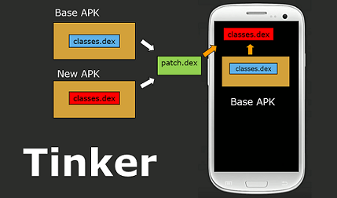
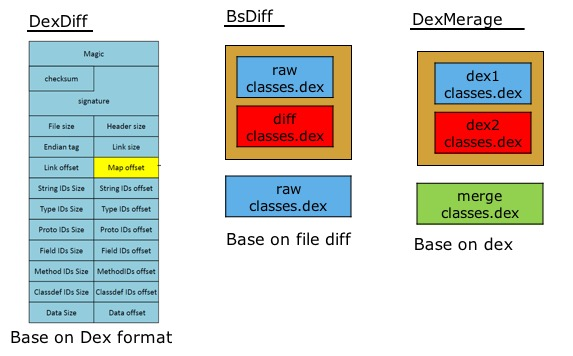
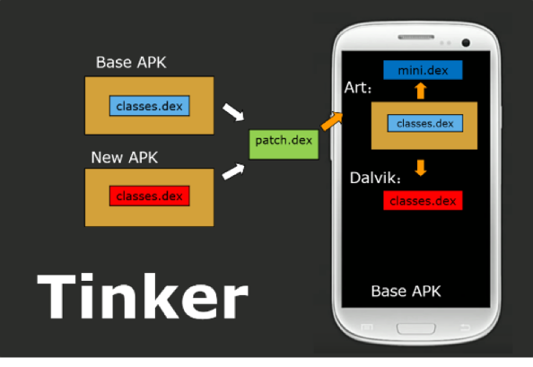
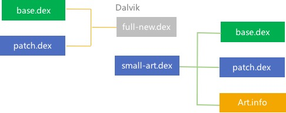
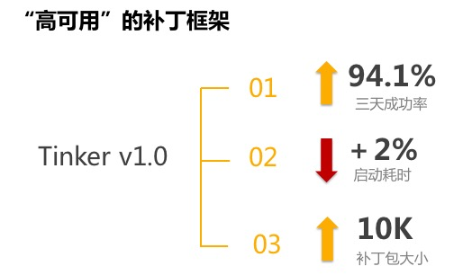

# 微信Tinker的一切都在这里，包括源码(一) #
最近半年以来，Android热补丁技术热潮继续爆发，各大公司相继推出自己的开源框架。Tinker在最近也顺利完成了公司的审核，并非常荣幸的成为githun.com/Tencent上第一个正式公开的项目。

回顾这半年多的历程，这是一条跪着走完，坑坑不息之路。或许只有自己真正经历过，深入研究过, 才会真正的明白
> 热补丁不是请客吃饭

对热补丁技术本身，还是对使用者来说都是如此。它并不简单，也有着自己的局限性，在使用之前我们需要对它有所了解。我希望通过分享微信在这历程中的思考与经验，能帮助大家更容易的决定是否在自己的项目中使用热补丁技术，以及选择什么样方案。

## 热补丁技术背景 ##
热补丁是什么以及它的应用场景介绍，大家可以参考文章[微信Android热补丁实践演进之路](http://mp.weixin.qq.com/s?__biz=MzAwNDY1ODY2OQ==&mid=2649286306&idx=1&sn=d6b2865e033a99de60b2d4314c6e0a25#rd)。

在笔者看来Android热补丁技术应该分为以下两个流派：

* Native，代表有阿里的Dexposed、AndFix与腾讯的内部方案KKFix；
* Java, 代表有Qzone的超级补丁、大众点评的nuwa、百度金融的rocooFix, 饿了么的amigo以及美团的robust。

Native流派与Java流派都有着自己的优缺点，它们具体差异大家可参考上文。事实上从来都没有最好的方案，只有最适合自己的。

对于微信来说，我们希望得到一个“高可用”的补丁框架，它应该满足以下几个条件：

1. **稳定性与兼容性**；微信需要在数亿台设备上运行，即使补丁框架带来1%的异常，也将影响到数万用户。保证补丁框架的稳定性与兼容性是我们的第一要务；
2. **性能**；微信对性能要求也非常苛刻，首先补丁框架不能影响应用的性能，这里基于大部分情况下用户不会使用到补丁。其次补丁包应该尽量少，这关系到用户流量与补丁的成功率问题；
3. **易用性**；在解决完以上两个核心问题的前提下，我们希望补丁框架简单易用，并且可以全面支持，甚至可以做到功能发布级别。

在“高可用”这个大前提下，微信对当时存在的两个方案做了大量的研究：

1. Dexposed/AndFix；最大挑战在于稳定性与兼容性，而且native异常排查难度更高。另一方面，由于无法增加变量与类等限制，无法做到功能发布级别；
2. Qzone；最大挑战在于性能，即Dalvik平台存在插桩导致的性能损耗，Art平台由于地址偏移问题导致补丁包可能过大的问题；

在2016年3月，微信为了追寻“高可用”这个目标，决定尝试搭建自己的补丁框架——Tinker。Tinker框架的演绎并不是一蹴而就，它大致分为三个阶段，每一阶段需要解决的核心问题并不相同。而Tinker v1.0的核心问题是实现符合性能要求的Dex补丁框架。

## Tinker v1.0－性能极致追求之路 ##
为了稳定性与兼容性，微信选择了Java流派。当前最大难点在于如何突破Qzone方案的性能问题，这时通过研究Instant Run的冷插拔与buck的[exopackage](https://buckbuild.com/article/exopackage.html)给了我们灵感。它们的思想都是全量替换新的Dex。

简单来说，我们通过完全使用了新的Dex，那样既不出现Art地址错乱的问题，在Dalvik也无须插桩。当然考虑到补丁包的体积，我们不能直接将新的Dex放在里面。但我们可以将新旧两个Dex的差异放到补丁包中，这里我们可以调研的方法有以下几个：

1. BsDiff；它格式无关，但对Dex效果不是特别好，而且非常不稳定。当前微信对于so与部分资源，依然使用bsdiff算法；
2. DexMerge；它主要问题在于合成时内存占用过大，一个12M的dex，峰值内存可能达到70多M；
3. DexDiff；通过深入Dex格式，实现一套diff差异小，内存占用少以及支持增删改的算法。

如何选择？在“高可用”的核心诉求下，性能问题也尤为重要。非常庆幸微信在当时那个节点坚决的选择了自研DexDiff算法，这过程虽然有苦有泪，但也正是有它，才有现在的Tinker。

### 一. DexDiff技术实践 ###

在不断的深入研究[Dex格式](https://source.android.com/devices/tech/dalvik/dex-format.html
)后，我们发现自己跳进了一个深坑，主要难点有以下三个：

1. Dex格式复杂；Dex大致分为像StringID，TypeID这些Index区域以及使用Offset的Data区域。它们有大量的互相引用，一个小小的改变可能导致大量的Index与Offset变化；
2. dex2opt与dex2oat校验；在这两个过程系统会做例如四字节对齐，部分元素排序等校验，例如StringID按照内容的Unicode排序，TypeID按照StringID排序...
3. 低内存，快速；这要求我们对Dex每一块做到一次读写，无法像baksmali与dexmerge那样完全结构化。

这不仅要求我们需要研究透Dex的格式，也要把dex2opt与dex2oat的代码全部研究透。现在回想起来，这的确是一条跪着走完的路。与研究Dalvik与Art执行一致，这是经历一次次翻看源码，一次次编Rom查看日志，一次次dump内存结构换来的结果。

下面以最简单的Index区域举例：

要想将从左边序列更改成右边序列，Diff算法的核心在于如何生成最小操作序列，同时修正Index与Offset，实现增删改的功能。

1. Del 2；"b"元素被删除，它对应的Index是2，为了减少补丁包体积，除了新增的元素其他一律只存Index;
2. "c", "d", "e"元素自动前移，无须操作；
3. Addf(5); 在第五个位置增加"f"这个元素。

对于Offset区，由于每个Section可能有非常多的元素，这里会更加复杂。最后我们得到最终的操作队列，为什么DexDiff可以做到内存非常少？这是因为DexDiff算法是每一个操作的处理，它无需一次性读入所有的数据。DexDiff的各项数据如下：

通过DexDiff算法的实现，我们既解决了Dalvik平台的性能损耗问题，又解决了Art平台补丁包过大的问题。但这套方案的缺点在于占Rom体积比较大，微信考虑到移动设备的存储空间提升比较快，增加几十M的Rom空间这个代价可以接受。

### 二. Android N的挑战 ###
信心满满上线后，却很快收到华为反馈的一个Crash：

而且这个Crash只在Android N上出现，在当时对我们震动非常大，难道Android N不支持Java方式热补丁了？难道这两个月的辛苦都白费了吗？一切想象都苍白无力，只有继续去源码里面找原因。

在之前的基础上，这一块的研究并没有花太多的时间，主要是Android N的混合编译模式导致。更多的详细分析可参考文章[Android N混合编译与对热补丁影响解析](http://mp.weixin.qq.com/s?__biz=MzAwNDY1ODY2OQ==&mid=2649286341&idx=1&sn=054d595af6e824cbe4edd79427fc2706#rd)。

### 三. 厂商OTA的挑战 ###

刚刚解决完Android N的问题，还在沉醉在自己的胜利的愉悦中。前线很快又传来噩耗，小米反馈开发版的一些用户在微信启动时黑屏，甚至ANR.

当时第一反应是不可能，所有的DexOpt操作都是放到单独的进程，为什么只在Art平台出现？为什么小米开发版用户反馈比较多？经过分析，我们发现优化后odex文件存在有效性的检查：

* Dalvik平台：modtime/crc...
* Art平台： checksum/image_checksum/image_offset...

这就非常好理解了，因为OTA之后系统image改变了，odex文件用到image的偏移地址很可能已经错误。对于ClassN.dex文件，在OTA升级系统已完成重新dex2oat，而补丁是动态加载的，只能在第一次执行时同步执行。

这个耗时可能高达十几秒，黑屏甚至ANR也是非常好理解。那为什么只有小米用户反馈比较多呢？这也是因为小米开发版每周都会推送系统升级的原因。

在当时那个节点上，我们重新的审视了全量合成这一思路，再次对方案原理本身产生怀疑，它在Art平台上面带来了以下几个代价：

1. OTA后黑屏问题；这里或许可以通过lLoading界面实现，但并不是很好的方案；
2. Rom体积问题；一个10M的Dex，在Dalvik下odex产物只有11M左右，但在Art平台，可以达到30多M；
3. Android N的问题；Android N在混合编译上努力，被补丁全量合成机制所废弃了。这是因为动态加载的Dex，依然是全量编译。

回想起来，Qzone方案它只把需要的类打包成补丁推送，在Art平台上可能导致补丁很大，但它肯定比全量合成10M的Dex少很多很多。在此我们提出分平台合成的想法，即在Dalvik平台合成全量Dex，在Art平台合成需要的Dex

DexDiff算法已经非常复杂，事实上要实现分平台合成并不容易。

主要难点有以下几个方面：

* small dex的类收集；什么类应该放在这个小的Dex中呢？
* ClassN处理；对于ClassN怎么样处理，可能出现类从一个Dex移动到另外一个Dex?
* 偏移二次修正; 补丁包中的操作序列如何二次修正？
* Art.info的大小； 为了修正偏移所引入的info文件的大小？

庆幸的是，面对困难我们并没有畏惧，最后实现了这一套方案，这也是其他全量合成方案所不能做到的：

1. Dalvik全量合成，解决了插桩带来的**性能损耗**；
2. Art平台合成small dex，解决了**全量合成方案占用Rom体积大, OTA升级以及Android N的问题**；
3. 大部分情况下Art.info仅仅1-20K, **解决由于补丁包可能过大的问题**；

事实上，DexDiff算法变的如此复杂，怎么样保证它的正确性呢？微信为此做了以下三件事情：

1. 随机组成Dex校验，覆盖大部分case；
2. 微信200个版本的随机Diff校验, 覆盖日常使用情况；
3. Dex文件合成产物有效性校验，即使算法出现问题，也只是编译不出补丁包。
每一次DexDiff算法的更新，都需要经过以上三个Test才可以提交，这样DexDiff的这套算法已完成了整个闭环。

### 四. 其他技术挑战 ###
在实现过程，我们还发现其他的一些问题：

1. Xposed等微信插件; 市面上有各种各样的微信插件，它们在微信启动前会提前加载微信中的类，这会导致两个问题：

	a. Dalvik平台：出现**Class ref in pre-verified class resolved to unexpected implementation**的crash；

	b. Art平台:出现部分类使用了旧的代码，这可能导致补丁无效，或者地址错乱的问题。
	
	**微信在这里的处理方式是若crash时发现安装了Xposed，即清除并不再应用补丁。**

 2. Dex反射成功但是不生效；部分三星android-19版本存在Dex反射成功，但出现类重复时，查找顺序始终从base.apk开始。
   	**微信在这里的处理方式是增加Dex反射成功校验，具体通过在框架中埋入某个类的isPatch变量为false。在补丁时，我们自动将这个变量改为true。通过这个变量最终的数值，我们可以知道反射成功与否。**

## Tinker v1.0总结 ##
### 一. 关于性能 ###

通过Tinker v1，0的努力，我们解决了Qzone方案的性能问题，得到一个符合“高可用”性能要求的补丁框架。

* 它补丁包大小非常少，通常都是10k以内；
* 对性能几乎没有影响, 2%的性能影响主要原因是微信运行时校验补丁Dex文件的md5导致(虽然文件在/data/data/目录，微信为了更高级别的安全)；
* Art平台通过革命性的分平台合成，既解决了地址偏移的问题，占Rom体积与Qzone方案一致。

### 二. 关于成功率 ###

也许有人会质疑微信成功率为什么这么低，其他方案都是99%以上。事实上，我们的成功率计算方式是：
> 应用成功率= 补丁版本转化人数/基准版本安装人数

即三天后，94.1%的基础版本都成功升级到补丁版本，由于基础版本人数也是持续增长，同时可能存在基准或补丁版本用户安装了其他版本，所以本统计结果应略为偏低，但它能现实的反应补丁的线上总体覆盖情况。

事实上，采用Qzone方案，3天的成功率大约为96.3%，这里还是有很多的优化空间。

### 三. Tinker v2.0－稳定性的探寻之路 ###

在v1.0阶段，大部分的异常都是通过厂商反馈而来，Tinker并没有解决“高可用”下最核心的稳定性与兼容性问题。我们需要建立完整的监控与补丁回退机制，监控每一个阶段的异常情况。这也是Tinker v2.0的核心任务，由于边幅问题这部分内容将放在下一篇文章。
  
---
关注Tinker，来Github给我们star吧
>[https://github.com/Tencent/tinker](https://github.com/Tencent/tinker)